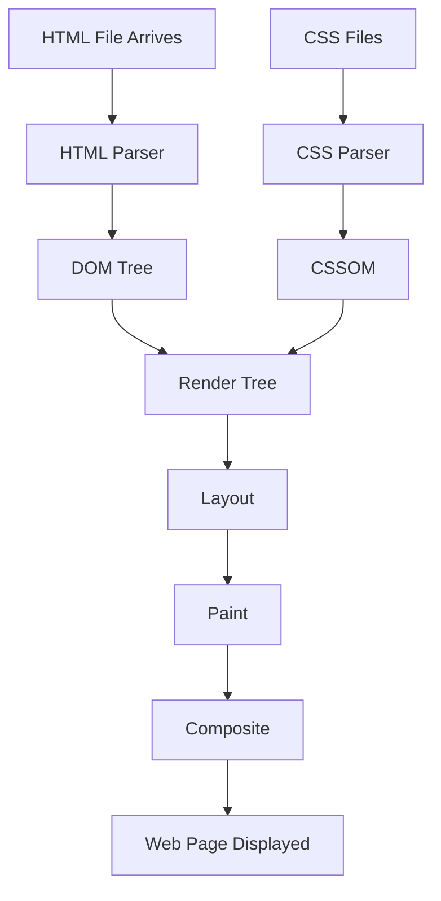

# Chapter 1: What is HTML?

> **Series:** The Complete HTML Reference: A–Z Guide for Modern Web Development

---

## Welcome

Welcome to **The Complete HTML Reference: A–Z Guide for Modern Web Development**.

This series is not another beginner's HTML tutorial. Instead, it is designed to become a complete technical reference for HTML—from the simplest concepts to advanced browser internals.

Whether you are a school student writing your first web page, a college student preparing for interviews, or an experienced developer looking for a reliable reference, this guide aims to provide everything you need in one place.

Unlike many tutorials that only explain *how* to use HTML elements, this series also explains **why HTML works the way it does**, **how browsers interpret HTML**, **how HTML interacts with CSS and JavaScript**, and **the best practices recommended by modern web standards**.

By the end of this series, you will understand HTML not just as a markup language, but as the foundation of the modern web.

---

# What You'll Learn

After completing this chapter, you will understand:

* What HTML is.
* Why HTML was created.
* What HTML stands for.
* Why HTML is called a markup language.
* How HTML differs from programming languages.
* The role of HTML in modern web development.
* How browsers read HTML documents.
* The relationship between HTML, CSS, and JavaScript.
* How your first HTML page is created.

---

# Prerequisites

Good news—you don't need any prior programming knowledge.

All you need is:

* A computer.
* A text editor such as **Notepad++**, **Visual Studio Code**, or even Windows Notepad.
* A modern web browser like Chrome, Firefox, Edge, or Safari.
* Curiosity and a willingness to learn.

---

# What Is HTML?

**HTML** stands for **HyperText Markup Language**.

It is the **standard markup language** used to create and structure web pages.

Every website you visit on the Internet uses HTML in some form. Whether you're reading a news article, watching a video, shopping online, or browsing your social media feed, HTML is working behind the scenes to describe the structure of that page.

HTML tells the browser:

* "This is a heading."
* "This is a paragraph."
* "This is an image."
* "This is a table."
* "This is a button."
* "This is a navigation menu."

Without HTML, a browser would simply receive plain text with no information about how it should be organized or displayed.

---

# Think of HTML as the Skeleton of a Website

Imagine building a house.

A house is made up of several parts:

* Foundation
* Walls
* Doors
* Windows
* Roof
* Interior decoration
* Electrical wiring

A website is built in a similar way.

| Technology | Purpose                                                      |
| ---------- | ------------------------------------------------------------ |
| HTML       | Creates the structure of the webpage.                        |
| CSS        | Styles the webpage with colors, fonts, spacing, and layouts. |
| JavaScript | Adds interactivity and dynamic behavior.                     |

Think of it this way:

* **HTML is the skeleton.**
* **CSS is the skin and clothing.**
* **JavaScript is the brain and muscles.**

Without HTML, CSS has nothing to style, and JavaScript has nothing to interact with.

---

# Breaking Down the Name "HTML"

Let's understand each word individually.

## HyperText

HyperText refers to text that contains links to other documents.

Unlike a printed book, where pages are read in sequence, HyperText allows users to instantly jump from one document to another by clicking a hyperlink.

This ability to connect documents together is one of the core ideas behind the World Wide Web.

---

## Markup

Markup means adding descriptive information around content.

Instead of simply writing:

```
Welcome to my website
```

HTML allows us to identify that text as a heading:

```html
<h1>Welcome to my website</h1>
```

The `<h1>` element tells the browser:

> "This text is the main heading of the page."

Similarly,

```html
<p>This is a paragraph.</p>
```

tells the browser that the enclosed text should be treated as a paragraph.

Markup does not change the content itself; it describes the purpose of the content.

---

## Language

HTML follows a standardized set of rules that browsers understand.

Because it has its own syntax and grammar, it is called a **language**.

However, HTML is **not a programming language**.

Instead, it is a **markup language**.

---

# Is HTML a Programming Language?

One of the most common misconceptions among beginners is that HTML is a programming language.

The answer is **No**.

Programming languages can:

* Perform calculations.
* Make decisions.
* Execute loops.
* Store variables.
* Create algorithms.

HTML cannot perform any of these tasks.

Instead, HTML simply describes the structure of content.

For example:

```html
<h2>About Us</h2>

<p>We build educational websites.</p>
```

This code tells the browser:

* Display a heading.
* Display a paragraph.

Nothing more.

There is no calculation or decision-making involved.

---

# Why Was HTML Created?

In the late 1980s, researchers needed a simple way to share scientific documents across different computers connected to the Internet.

The challenge was that different computer systems stored documents in different formats.

HTML solved this problem by providing a universal format that any web browser could understand.

It also introduced hyperlinks, allowing documents to connect with one another.

This idea eventually evolved into the World Wide Web we know today.

---

# What Can HTML Do?

HTML is capable of structuring almost every type of content found on a webpage.

Using HTML, you can create:

* Headings
* Paragraphs
* Hyperlinks
* Images
* Audio
* Video
* Tables
* Forms
* Navigation menus
* Lists
* Articles
* Sidebars
* Footers
* Interactive form controls
* Embedded maps
* Embedded videos
* SVG graphics
* Canvas drawings
* Semantic page layouts

Although HTML provides the structure, it does not determine how these elements look. That responsibility belongs to CSS.

---

# Your First HTML Program

Let's create your first webpage.

Open your preferred text editor and create a new file named:

```
index.html
```

Now type the following code:

```html
<!DOCTYPE html>
<html lang="en">
<head>
    <meta charset="UTF-8">
    <title>My First HTML Page</title>
</head>

<body>

    <h1>Hello, World!</h1>

    <p>Congratulations! You have created your first HTML page.</p>

</body>
</html>
```

Save the file.

Now double-click `index.html`.

Your default web browser will open and display:

```
Hello, World!

Congratulations! You have created your first HTML page.
```

Congratulations! You have just created your first webpage.

---

# Did You Know?

> Every modern website begins as an HTML document.

Even large websites such as search engines, e-commerce platforms, news portals, and social media applications ultimately deliver HTML to your browser.

The browser then combines HTML with CSS and JavaScript to render the final page you see on your screen.

---

# Summary

In this first part of Chapter 1, you learned:

* HTML stands for **HyperText Markup Language**.
* HTML is the standard language for creating web pages.
* HTML provides the structure of a webpage.
* HTML is not a programming language.
* HTML works together with CSS and JavaScript.
* Every website begins with an HTML document.
* You created your very first HTML page.

---

> **Coming Up Next**

In the next section of Chapter 1, we will explore:

* The history of HTML
* The evolution from HTML 1.0 to HTML5
* The HTML Living Standard
* How the World Wide Web changed web development
* The organizations that maintain HTML today
* Why HTML continues to evolve even after HTML5

---

# The History of HTML

To truly understand HTML, it's important to know where it came from and why it was invented. HTML wasn't originally designed to build beautiful websites—it was created to solve a problem: **sharing information easily across different computers**.

The story of HTML begins before the modern web even existed.

---

## Before HTML

Before HTML, computers could exchange files over networks, but there was no simple and universal way to display documents.

Different computers used different operating systems and document formats.

For example:

* A document created on one computer might not open correctly on another.
* Scientific papers often had to be printed and mailed.
* Sharing research across countries was slow and inconvenient.

Researchers wanted a standard way to publish documents that anyone could read, regardless of the computer they were using.

HTML became the solution.

---

# The Birth of the World Wide Web

In **1989**, a British computer scientist named **Tim Berners-Lee** proposed a revolutionary idea while working at **CERN (European Organization for Nuclear Research)** in Switzerland.

His idea was simple:

> "What if documents stored on computers around the world could be connected using clickable links?"

This concept eventually became known as the **World Wide Web (WWW)**.

The World Wide Web is **not the Internet**.

The Internet is the global network of connected computers.

The World Wide Web is a service that runs on top of the Internet, allowing people to access linked documents through web browsers.

---

# The Three Technologies That Started the Web

Tim Berners-Lee developed three core technologies that still power the web today.

| Technology | Purpose                                           |
| ---------- | ------------------------------------------------- |
| HTML       | Describes the structure of web pages.             |
| HTTP       | Transfers web pages between servers and browsers. |
| URL        | Identifies the location of resources on the web.  |

Even after more than three decades, these three technologies remain the foundation of the modern Internet.

---

# The First Website

The world's first website went online in **1991**.

Its purpose was not entertainment or shopping.

Instead, it explained:

* What the World Wide Web was
* How to create web pages
* How to install a web server
* How to use hyperlinks

Although very simple by today's standards, this website demonstrated that information could be shared globally using HTML.

---

# HTML Through the Years

HTML has evolved continuously since its creation.

Each version introduced new features and improvements.

## HTML 1.0 (1993)

HTML 1.0 was the first publicly available version.

It supported only a small number of elements, including:

* Headings
* Paragraphs
* Hyperlinks
* Lists

Web pages looked very simple because CSS did not yet exist.

---

## HTML 2.0 (1995)

HTML 2.0 became the first official standard.

It introduced:

* Forms
* Form controls
* Better interoperability between browsers

This made it possible to build interactive websites where users could submit information.

---

## HTML 3.2 (1997)

HTML 3.2 introduced several visual elements.

Developers could now use:

* Tables
* Images
* Applets
* Text formatting elements

Unfortunately, many presentation-related elements mixed content with design, which later became difficult to maintain.

---

## HTML 4.01 (1999)

HTML 4.01 marked a major improvement.

The web community began separating **structure** from **presentation**.

This encouraged developers to use:

* HTML for structure
* CSS for design

Many older presentational elements were deprecated in favor of CSS.

This philosophy is still followed today.

---

## XHTML

Around the year 2000, developers attempted to make HTML stricter by introducing XHTML.

XHTML required:

* Proper nesting of elements
* Lowercase element names
* Every element to be closed correctly
* Well-formed documents

Although XHTML influenced better coding practices, it never became as popular as expected.

---

## HTML5 (2014)

HTML5 transformed web development.

It introduced many powerful features, including:

* Semantic elements (`<header>`, `<footer>`, `<article>`, `<section>`)
* Audio support
* Video support
* Canvas graphics
* SVG integration
* Better forms
* Local storage
* Drag and Drop API
* Geolocation support

HTML5 reduced the need for browser plugins such as Adobe Flash.

---

# HTML Living Standard

Many beginners think HTML stopped evolving after HTML5.

That is **not true**.

Today, HTML no longer has fixed version numbers.

Instead, it follows something called the **Living Standard**.

A Living Standard is a continuously updated specification.

Rather than releasing HTML6 or HTML7, new features are added gradually as browsers adopt them.

This allows HTML to evolve without forcing developers to learn entirely new versions.

---

# Who Maintains HTML Today?

Modern HTML is maintained primarily by the **WHATWG (Web Hypertext Application Technology Working Group)**.

The WHATWG continuously updates the HTML Living Standard.

Browser vendors such as:

* Google (Chrome)
* Mozilla (Firefox)
* Apple (Safari)
* Microsoft (Edge)

work together to implement these standards consistently.

This collaboration helps ensure that websites behave similarly across different browsers.

---

# Why HTML Continues to Evolve

The web is constantly changing.

New technologies appear every year.

Developers expect websites to support:

* Faster performance
* Better accessibility
* Improved security
* Mobile devices
* Smart TVs
* Wearables
* Voice assistants
* Virtual Reality (VR)
* Augmented Reality (AR)

To meet these demands, HTML continues to evolve through the Living Standard.

---

# Timeline of HTML Evolution

```text
1989
│
├── Tim Berners-Lee proposes the World Wide Web
│
1991
│
├── First Website Published
│
1993
│
├── HTML 1.0
│
1995
│
├── HTML 2.0
│
1997
│
├── HTML 3.2
│
1999
│
├── HTML 4.01
│
2000
│
├── XHTML
│
2014
│
├── HTML5
│
Today
│
└── HTML Living Standard
```

---

# Did You Know?

> The first websites contained only text and hyperlinks.

There were:

* No animations
* No videos
* No CSS
* No JavaScript frameworks
* No responsive design

Despite their simplicity, these early websites laid the foundation for the billions of web pages that exist today.

---

# Key Takeaways

After reading this section, you should understand:

* Why HTML was created.
* Who invented HTML.
* The difference between the Internet and the World Wide Web.
* The major milestones in HTML's evolution.
* Why HTML5 is not the final version.
* What the HTML Living Standard is.
* Why HTML continues to evolve.

---

## Up Next

In the next section of Chapter 1, we'll cover:

* How the Internet Works
* How a Browser Requests a Web Page
* What Happens When You Type a Website Address
* Client–Server Architecture
* HTTP Request and Response
* How HTML Reaches Your Browser
* The Browser Rendering Process

---

# How the Internet Delivers an HTML Page

Before learning HTML elements, it's important to understand **how an HTML document reaches your browser**.

Many beginners think that when they type a website address, the browser somehow "knows" what to display.

In reality, a fascinating sequence of events takes place in just a fraction of a second.

Understanding this process will help you appreciate why HTML is the foundation of every website.

---

# Client and Server

The web is based on a simple concept called the **Client–Server Model**.

There are two main participants:

* **Client**
* **Server**

## What is a Client?

A **client** is any device or application that requests information.

Examples include:

* Google Chrome
* Mozilla Firefox
* Microsoft Edge
* Safari
* Mobile browsers

Whenever you open a website, your browser acts as the client.

---

## What is a Server?

A **server** is a powerful computer that stores websites and sends files to visitors.

When someone visits your website, the server sends files such as:

* HTML
* CSS
* JavaScript
* Images
* Videos
* Fonts

Without a server, nobody else could access your website over the Internet.

---

# The Journey of an HTML Page

Suppose you type the following address into your browser:

```text
https://www.example.com
```

What happens next?

Let's follow the journey step by step.

---

## Step 1 – You Enter a URL

You type:

```text
https://www.example.com
```

into the browser's address bar.

The browser now needs to find where this website is located.

---

## Step 2 – DNS Lookup

Humans remember names like:

```text
www.example.com
```

Computers communicate using **IP addresses**, such as:

```text
93.184.216.34
```

A **DNS (Domain Name System)** server translates the domain name into an IP address.

Think of DNS as the Internet's phone book.

---

## Step 3 – Connecting to the Server

Once the browser knows the server's IP address, it establishes a connection.

If the website uses HTTPS (which most modern websites do), a secure encrypted connection is created.

Only after this secure connection is established can information be exchanged.

---

## Step 4 – Sending an HTTP Request

The browser sends a request asking for the webpage.

A simplified request looks like this:

```http
GET / HTTP/1.1
Host: www.example.com
```

This tells the server:

> "Please send me the homepage."

---

## Step 5 – The Server Responds

If everything is successful, the server sends back a response.

The response usually begins like this:

```http
HTTP/1.1 200 OK
```

This means:

> "Your request was successful."

The response then contains the HTML document.

For example:

```html
<!DOCTYPE html>
<html>
<head>
    <title>Example Website</title>
</head>

<body>

<h1>Welcome!</h1>

<p>Hello from the server.</p>

</body>
</html>
```

This HTML file is simply plain text.

It is **not yet a webpage**.

---

# HTML Is Just Text

This is one of the most important ideas in web development.

Your server does **not** send a finished webpage.

Instead, it sends:

* HTML
* CSS
* JavaScript

These are all text files.

The browser is responsible for transforming them into the visual page you see.

---

# The Browser Begins Reading HTML

Once the browser receives the HTML document, it begins reading it from top to bottom.

It does **not** skip randomly through the file.

Instead, it parses every character in order.

For example:

```html
<!DOCTYPE html>
<html>
<head>
<title>Learning HTML</title>
</head>

<body>

<h1>Hello!</h1>

<p>Welcome.</p>

</body>
</html>
```

The browser starts at `<!DOCTYPE html>` and continues until the final `</html>` tag.

---

# What Is Parsing?

Parsing means:

> Reading a document and understanding its structure.

The browser contains a special component called the **HTML Parser**.

Its job is to interpret every HTML element.

For example:

When the parser sees:

```html
<h1>Hello</h1>
```

it understands:

* This is a heading.
* It has level 1 importance.
* The text is "Hello".

The parser does this for every HTML element.

---

# Creating the DOM

While reading HTML, the browser creates something called the **Document Object Model (DOM)**.

The DOM is a tree-like representation of the HTML document.

Consider this HTML:

```html
<html>

<head>
<title>My Page</title>
</head>

<body>

<h1>Hello</h1>

<p>Welcome</p>

</body>

</html>
```

The browser internally builds a structure similar to this:

```text
Document
│
└── html
    ├── head
    │   └── title
    │       └── "My Page"
    │
    └── body
        ├── h1
        │   └── "Hello"
        │
        └── p
            └── "Welcome"
```

Notice that every HTML element becomes a **node** in the tree.

This tree is called the DOM.

---

# Why Is the DOM Important?

The DOM allows browsers and JavaScript to work with HTML.

For example, JavaScript can:

* Create new elements.
* Remove elements.
* Change text.
* Modify styles.
* Respond to user actions.

Without the DOM, modern interactive websites would not exist.

---

# HTML Alone Is Not Enough

Receiving HTML is only the first step.

The browser also downloads:

* CSS files
* JavaScript files
* Images
* Fonts
* Icons
* Videos

All of these resources are combined to create the final webpage.

---

# The Browser Rendering Pipeline

The browser follows a rendering pipeline to transform code into pixels.



Each stage has a specific purpose:

| Stage       | Purpose                                            |
| ----------- | -------------------------------------------------- |
| HTML Parser | Reads HTML.                                        |
| DOM         | Creates the document structure.                    |
| CSS Parser  | Reads CSS rules.                                   |
| CSSOM       | Creates a style tree.                              |
| Render Tree | Combines structure and styles.                     |
| Layout      | Calculates the size and position of every element. |
| Paint       | Draws pixels on the screen.                        |
| Composite   | Combines everything into the final webpage.        |

---

# Why HTML Must Be Correct

Because browsers read HTML sequentially, incorrectly written HTML can lead to:

* Unexpected layouts
* Missing content
* Accessibility issues
* JavaScript errors
* SEO problems

Modern browsers are forgiving and try to fix mistakes automatically, but developers should never rely on this behavior.

Writing valid HTML leads to more predictable and maintainable websites.

---

# Did You Know?

> A modern browser can parse thousands of HTML elements in just a few milliseconds.

This speed allows websites to appear almost instantly, even though many complex steps happen behind the scenes.

---

# Summary

In this section, you learned:

* The difference between a client and a server.
* How browsers request HTML.
* The purpose of DNS.
* How HTTP requests and responses work.
* That HTML is delivered as plain text.
* How browsers parse HTML.
* What the DOM is.
* Why the DOM is important.
* The browser rendering pipeline.

---

## Coming Up Next

The next section will cover one of the most fundamental topics in HTML:

* HTML Documents
* Elements
* Tags
* Opening and Closing Tags
* Nested Elements
* Empty Elements
* Attributes
* HTML Syntax Rules
* Case Sensitivity
* Whitespace
* Comments

By the end of the next section, you'll understand how every HTML document is constructed from individual building blocks.

---

# HTML Documents, Elements, Tags, and Attributes

Now that you understand what HTML is and how browsers receive and process an HTML document, it's time to learn the building blocks of HTML itself.

Every webpage, regardless of its complexity, is made up of **HTML elements**.

Whether you're creating a simple personal webpage or a large e-commerce platform, the same fundamental concepts apply.

In this section, we'll explore:

* HTML documents
* HTML elements
* HTML tags
* Opening and closing tags
* Nested elements
* Empty elements
* HTML attributes
* HTML syntax rules
* Comments
* Whitespace

Mastering these concepts is essential because every HTML element you'll learn later builds upon them.

---

# What Is an HTML Document?

An **HTML document** is a plain text file that contains HTML code.

It usually has one of these file extensions:

```text
.html
```

or

```text
.htm
```

Modern websites almost always use the **`.html`** extension.

An HTML document describes the structure of a webpage. When opened in a browser, the browser interprets the document and displays it as a webpage.

---

# A Minimal HTML Document

The smallest valid HTML document looks like this:

```html
<!DOCTYPE html>
<html>
<head>
    <title>My First Page</title>
</head>

<body>

Hello World!

</body>
</html>
```

Although this document is very small, it already contains the essential parts of a webpage.

We'll study each of these elements in detail in later chapters.

---

# What Is an HTML Element?

An **HTML element** is the basic building block of every HTML document.

An element usually consists of:

* An opening tag
* Content
* A closing tag

For example:

```html
<p>Hello, World!</p>
```

Here:

* `<p>` is the opening tag.
* `Hello, World!` is the content.
* `</p>` is the closing tag.

Together, they form a **paragraph element**.

---

# What Is an HTML Tag?

Many beginners confuse **tags** and **elements**.

They are related, but they are not exactly the same thing.

A **tag** is the text enclosed in angle brackets (`< >`).

For example:

```html
<h1>
```

and

```html
</h1>
```

are tags.

An **element** includes:

* Opening tag
* Content
* Closing tag

Example:

```html
<h1>Learning HTML</h1>
```

This entire structure is the **element**.

---

# Anatomy of an HTML Element

Consider the following example:

```html
<h2>Welcome to HTML</h2>
```

Let's break it down.

| Part              | Description |
| ----------------- | ----------- |
| `<h2>`            | Opening tag |
| `Welcome to HTML` | Content     |
| `</h2>`           | Closing tag |

Everything together forms one HTML element.

---

# Opening Tags

Opening tags tell the browser where an element begins.

Examples:

```html
<h1>

<p>

<div>

<table>

<section>
```

Opening tags may also contain attributes, which we'll learn shortly.

---

# Closing Tags

Most HTML elements require a closing tag.

Closing tags contain a forward slash.

Example:

```html
</p>
```

Closing tags tell the browser that the current element has ended.

---

# Why Closing Tags Matter

Imagine writing:

```html
<p>This is paragraph one.

<p>This is paragraph two.
```

Modern browsers may still display something reasonable because they automatically fix some HTML errors.

However, relying on automatic correction is considered poor practice.

Always close elements correctly unless the HTML specification explicitly says they are **void (empty) elements**.

---

# Nested Elements

HTML elements can contain other elements.

This is known as **nesting**.

Example:

```html
<article>

    <h2>Learning HTML</h2>

    <p>HTML is the foundation of every website.</p>

</article>
```

Here:

* `<article>` is the parent element.
* `<h2>` is a child element.
* `<p>` is also a child element.

Nested elements create a hierarchical structure that browsers convert into the DOM tree.

---

# Proper Nesting

Correct nesting:

```html
<p>

This is <strong>important</strong> text.

</p>
```

Incorrect nesting:

```html
<p>

This is <strong>important</p>

</strong>
```

The browser will attempt to repair invalid HTML, but the result may not be what you expect.

Always close elements in the reverse order that you opened them.

---

# Parent and Child Relationships

HTML follows a tree structure.

Example:

```html
<body>

    <main>

        <section>

            <h1>HTML Guide</h1>

        </section>

    </main>

</body>
```

Relationship:

```text
body
└── main
    └── section
        └── h1
```

Understanding these relationships becomes very important when working with CSS and JavaScript.

---

# Empty (Void) Elements

Not every HTML element has content.

Some elements are complete by themselves.

These are called **empty elements** or **void elements**.

Examples include:

```html
<br>

<hr>


<meta>

<link>

<input>
```

Notice that these elements do **not** require closing tags.

For example:

```html

```

There is **no** closing `</img>` tag.

---

# Self-Closing Tags

You may sometimes see code like this:

```html

```

The trailing slash (`/`) comes from XHTML.

In HTML5, both of the following are valid:

```html

```

and

```html

```

Most developers omit the trailing slash in modern HTML.

---

# What Are Attributes?

Attributes provide **additional information** about an HTML element.

They appear inside the opening tag.

Example:

```html
<a href="https://example.com">Visit Website</a>
```

Here:

* `href` is an attribute.
* `"https://example.com"` is its value.

The browser uses this information to determine where the hyperlink should lead.

---

# Multiple Attributes

Elements may contain more than one attribute.

Example:

```html

```

Here the `` element contains four attributes.

Each attribute serves a different purpose.

---

# Attribute Syntax

The general syntax is:

```html
attribute="value"
```

Example:

```html
id="header"
```

or

```html
class="container"
```

or

```html
lang="en"
```

Attributes should always be written inside the opening tag.

---

# Global Attributes

Some attributes can be used on almost every HTML element.

Examples include:

| Attribute  | Purpose                     |
| ---------- | --------------------------- |
| `id`       | Unique identifier           |
| `class`    | CSS and JavaScript grouping |
| `style`    | Inline CSS                  |
| `title`    | Tooltip text                |
| `lang`     | Language of the content     |
| `hidden`   | Hides an element            |
| `tabindex` | Keyboard navigation         |

We'll dedicate an entire chapter to global attributes later in this series.

---

# HTML Is Not Case Sensitive

Modern HTML is **case-insensitive**.

The following are technically equivalent:

```html
<H1>Hello</H1>
```

```html
<h1>Hello</h1>
```

However, the web development community follows a clear convention:

> Always write HTML elements and attributes in lowercase.

This improves readability and consistency.

---

# Whitespace in HTML

HTML ignores extra spaces and line breaks.

For example:

```html
<p>

Hello


World

</p>
```

The browser displays:

```text
Hello World
```

Multiple spaces are collapsed into a single space.

If you need to preserve spacing, HTML provides special elements and CSS techniques, which we'll discuss in later chapters.

---

# HTML Comments

Comments allow developers to leave notes inside the source code.

Comments are ignored by the browser.

Syntax:

```html
<!-- This is an HTML comment -->
```

Example:

```html
<body>

<!-- Main Navigation -->

<nav>

...

</nav>

</body>
```

Comments are useful for:

* Documenting code
* Explaining complex sections
* Temporarily disabling code during testing

---

# Best Practices

As you begin writing HTML, develop good habits from the start.

* Always use lowercase element names.
* Close every non-void element properly.
* Indent nested elements consistently.
* Use meaningful element names.
* Avoid unnecessary comments.
* Keep your HTML clean and readable.
* Validate your HTML regularly.

Clean HTML is easier to maintain, debug, and collaborate on.

---

# Common Beginner Mistakes

Avoid these common mistakes:

❌ Forgetting to close elements.

❌ Incorrect nesting of elements.

❌ Using uppercase tags inconsistently.

❌ Forgetting quotation marks around attribute values.

❌ Adding closing tags to void elements like `` or `<br>`.

Recognizing these mistakes early will save you hours of debugging later.

---

# Summary

In this section, you learned:

* What an HTML document is.
* The difference between elements and tags.
* How opening and closing tags work.
* What nested elements are.
* Parent and child relationships.
* Empty (void) elements.
* HTML attributes.
* Global attributes.
* HTML comments.
* Whitespace behavior.
* Best practices for writing clean HTML.

---

## Coming Up Next

In the next section, we'll build your understanding even further by exploring:

* The Complete Structure of an HTML Document
* `<!DOCTYPE html>`
* The `<html>` Element
* The `<head>` Element
* The `<body>` Element
* How Browsers Interpret Document Structure
* HTML Validation
* Why Document Structure Matters

---

# The Complete Structure of an HTML Document

Every webpage you visit on the Internet follows a basic structure.

Whether it's a personal portfolio, an online shopping website, a government portal, or a social media platform, every HTML document starts with the same fundamental building blocks.

Understanding this structure is one of the most important skills for every web developer.

Let's examine a complete HTML document.

```html
<!DOCTYPE html>
<html lang="en">

<head>
    <meta charset="UTF-8">
    <meta name="viewport" content="width=device-width, initial-scale=1.0">

    <title>My First HTML Document</title>
</head>

<body>

    <h1>Hello, World!</h1>

    <p>Welcome to HTML.</p>

</body>

</html>
```

Although this example contains only a few lines of code, every line has a specific purpose.

We'll now examine each part one by one.

---

# Overall Structure

The document can be divided into five major sections.

```text
HTML Document
│
├── <!DOCTYPE html>
│
├── <html>
│
│   ├── <head>
│   │
│   └── <body>
│
└── </html>
```

Think of it like a book.

| HTML Part         | Similar to a Book                   |
| ----------------- | ----------------------------------- |
| `<!DOCTYPE html>` | Book edition information            |
| `<html>`          | Entire book                         |
| `<head>`          | Book cover and metadata             |
| `<body>`          | Actual pages containing the content |

---

# `<!DOCTYPE html>`

The very first line is:

```html
<!DOCTYPE html>
```

This tells the browser:

> "This document follows the modern HTML standard."

Without it, browsers may switch into compatibility modes designed for very old websites.

Although it looks like an HTML tag, **it is not an HTML element**.

It is called a **Document Type Declaration**.

In **Chapter 2**, we'll dedicate an entire chapter to understanding this single line in detail.

---

# The `<html>` Element

Immediately after the DOCTYPE comes the `<html>` element.

```html
<html lang="en">
```

This is called the **root element**.

Every visible and invisible part of the webpage exists inside this element.

Think of it as the container that holds the entire document.

Nothing should exist outside the `<html>` element except the DOCTYPE declaration.

The `lang="en"` attribute tells browsers and assistive technologies that the primary language of the document is English.

This helps:

* Search engines
* Screen readers
* Translation software
* Accessibility tools

Later in this series, we'll study every attribute of the `<html>` element in depth.

---

# The `<head>` Element

The next major section is the `<head>` element.

```html
<head>

...

</head>
```

A common misunderstanding among beginners is thinking that everything inside `<head>` is displayed on the webpage.

This is **not true**.

Most information inside `<head>` is **metadata**.

Metadata means:

> "Information about the document."

Examples include:

* Page title
* Character encoding
* CSS files
* JavaScript files
* Search engine information
* Browser instructions
* Social media preview data

Although users usually don't see this information directly, browsers and search engines rely heavily on it.

---

# The `<title>` Element

Inside the `<head>` section you'll often find:

```html
<title>My First HTML Document</title>
```

This element defines the page title.

The title appears:

* On the browser tab.
* In bookmarks.
* In search engine results.
* When sharing links on many platforms.

Every webpage should have a meaningful title.

Poor titles negatively affect both usability and search engine optimization (SEO).

---

# The `<meta>` Element

You also saw:

```html
<meta charset="UTF-8">
```

This tells the browser which character encoding the document uses.

UTF-8 supports thousands of characters from languages around the world, including:

* English
* Tamil
* Hindi
* Japanese
* Arabic
* Chinese
* Korean

Using UTF-8 ensures that text displays correctly across different devices and browsers.

Another common meta element is:

```html
<meta name="viewport" content="width=device-width, initial-scale=1.0">
```

This helps webpages display properly on mobile devices.

Without it, responsive layouts may not behave as expected.

We'll explore every type of `<meta>` element in a dedicated chapter later in this series.

---

# The `<body>` Element

Everything visible on the webpage belongs inside the `<body>` element.

Example:

```html
<body>

<h1>Hello</h1>

<p>Welcome to HTML.</p>

</body>
```

The browser renders the contents of `<body>` for users to see and interact with.

Common elements inside `<body>` include:

* Headings
* Paragraphs
* Images
* Links
* Lists
* Tables
* Forms
* Videos
* Audio
* Navigation menus
* Buttons

If you can see it on the webpage, it is almost always inside the `<body>` element.

---

# How the Browser Interprets This Structure

When the browser receives the HTML document, it doesn't simply display the text.

Instead, it builds a hierarchical structure in memory.

For the earlier example, the browser creates something similar to:

```text
Document
│
├── DOCTYPE
│
└── html
    │
    ├── head
    │   ├── meta
    │   ├── meta
    │   └── title
    │
    └── body
        ├── h1
        └── p
```

This hierarchy is known as the **Document Object Model (DOM)**.

Every HTML element becomes an object that browsers and JavaScript can manipulate.

---

# Why Document Structure Matters

Correct document structure offers many benefits.

# Better Browser Compatibility

Modern browsers expect HTML documents to follow the standard structure.

Correctly structured documents render more consistently across browsers.

---

# Improved Accessibility

Screen readers use the document structure to help visually impaired users navigate webpages.

A properly structured document creates a better experience for everyone.

---

# Better SEO

Search engines analyze document structure when indexing webpages.

Using the correct hierarchy helps search engines understand the content more accurately.

---

# Easier Maintenance

A well-organized HTML document is easier to read, debug, and maintain.

As projects grow larger, proper organization becomes increasingly important.

---

# HTML Validation

Just because a browser displays a webpage doesn't necessarily mean the HTML is correct.

Browsers are designed to recover from many coding mistakes.

However, professional developers validate their HTML to ensure it follows the official specification.

Validation helps identify:

* Missing closing tags
* Invalid nesting
* Incorrect attributes
* Deprecated elements
* Syntax errors

Writing valid HTML improves reliability and long-term maintainability.

Later in this book, we'll learn how to validate HTML documents using professional tools.

---

# Best Practices for HTML Documents

Follow these recommendations whenever you create a new HTML file.

* Always begin with `<!DOCTYPE html>`.
* Use the `<html>` element as the document root.
* Include a meaningful `<title>`.
* Specify the document language with the `lang` attribute.
* Use UTF-8 character encoding.
* Include the viewport meta tag for responsive websites.
* Keep the document properly indented.
* Organize the `<head>` section logically.
* Place only visible page content inside `<body>`.

These practices are followed by professional web developers around the world.

---

# Did You Know?

> Every webpage you have ever visited—whether it's a search engine, an online store, a news website, or your own blog—ultimately follows this same fundamental document structure.

The complexity of a website may increase dramatically, but the underlying HTML document still begins with the same essential building blocks.

---

# Summary

In this section, you learned:

* The five major parts of an HTML document.
* The purpose of `<!DOCTYPE html>`.
* Why the `<html>` element is called the root element.
* What information belongs inside the `<head>` element.
* Why the `<title>` element is important.
* The purpose of common `<meta>` elements.
* Why all visible content belongs inside `<body>`.
* How browsers convert the document into a DOM tree.
* Why proper document structure improves compatibility, accessibility, and SEO.

---

## Coming Up Next

Chapter 1 is almost complete.

In the final section of this chapter, you'll learn:

* Common HTML Syntax Rules
* HTML Coding Conventions
* Beginner Mistakes to Avoid
* HTML Best Practices
* Hands-on Exercises
* Mini Project
* Interview Questions
* Chapter Summary
* Quick Reference Sheet