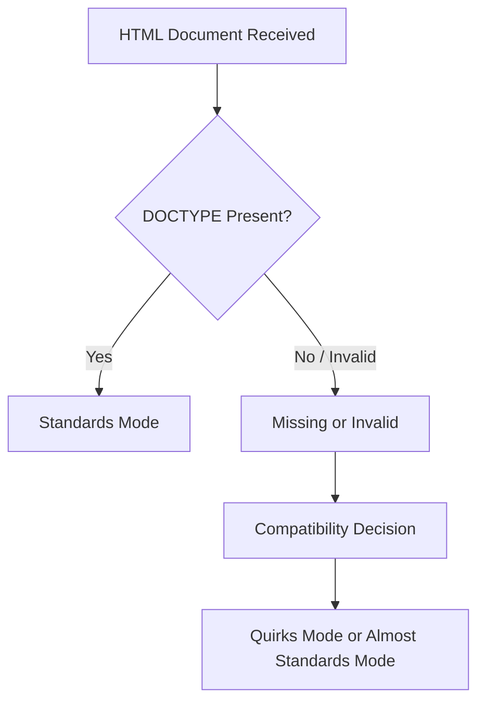
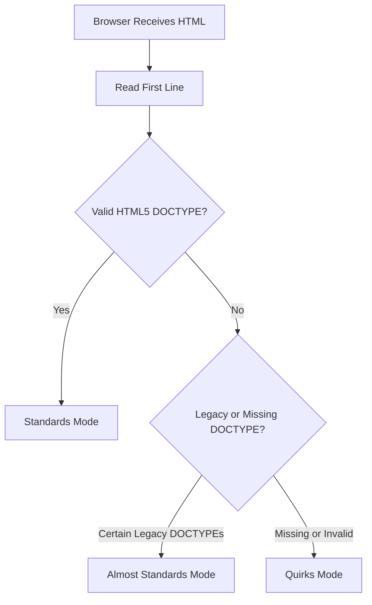

# Chapter 2: `<!DOCTYPE html>`

> **Series:** The Complete HTML Reference: A–Z Guide for Modern Web Development

---

# At a Glance

| Property                     | Value                                  |
| ---------------------------- | -------------------------------------- |
| Name                         | `<!DOCTYPE html>`                      |
| Type                         | Document Type Declaration              |
| HTML Element?                | ❌ No                                   |
| Requires Closing Tag?        | ❌ No                                   |
| Visible on Webpage?          | ❌ No                                   |
| Required in HTML5?           | ✅ Yes (Recommended for standards mode) |
| First Line of HTML Document? | ✅ Yes                                  |

---

# What You'll Learn

By the end of this chapter, you will understand:

* What `<!DOCTYPE html>` really is
* Why it exists
* Why it is **not** an HTML element
* Why every HTML document starts with it
* How browsers use it
* The history of DOCTYPE declarations
* The connection between SGML and HTML
* Standards Mode
* Almost Standards Mode
* Quirks Mode
* Common misconceptions
* Best practices followed by professional developers

---

## Introduction

Open almost any HTML file on the Internet and you'll see the following line at the very top:

```html
<!DOCTYPE html>
```

Most tutorials explain it in a single sentence:

> "It tells the browser this is an HTML5 document."

While technically correct, that explanation barely scratches the surface.

This tiny declaration has a fascinating history that stretches back to the early days of HTML and the evolution of web browsers.

Understanding **why it exists** helps you understand **how browsers decide to interpret your entire webpage**.

---

## What Is `<!DOCTYPE html>`?

`<!DOCTYPE html>` is a **Document Type Declaration (DTD declaration)**.

Its purpose is to inform the browser which HTML standard should be used when interpreting the document.

Unlike most lines in an HTML document:

* It is **not** an HTML element.
* It is **not** displayed in the browser.
* It is **not** part of the DOM.
* It does **not** contain content.

Instead, it acts as an instruction to the browser **before HTML parsing begins**.

---

## Why Isn't It an HTML Element?

Consider a normal HTML element:

```html
<p>Hello World</p>
```

This consists of:

* Opening tag
* Content
* Closing tag

Now compare it with:

```html
<!DOCTYPE html>
```

Notice the differences:

* It has no opening tag.
* It has no closing tag.
* It has no content.
* It cannot have child elements.

Because of these characteristics, it is classified as a **declaration**, not an HTML element.

---

## Where Must It Be Placed?

The DOCTYPE declaration **must appear before the `<html>` element**.

Correct:

```html
<!DOCTYPE html>
<html lang="en">
...
</html>
```

Incorrect:

```html
<html>

<!DOCTYPE html>

...
</html>
```

Browsers expect to encounter the declaration before they begin interpreting the HTML document.

---

## Why Is It the First Line?

The browser reads an HTML document from top to bottom.

Before parsing the HTML itself, the browser needs to determine:

* Which parsing rules to use
* Which rendering mode to activate
* Whether to follow modern standards or compatibility behavior

The DOCTYPE declaration provides that information immediately.

For this reason, it should always be the first line in the document (except for an optional UTF-8 Byte Order Mark, if present).

---

## The Browser's Decision Process

When a browser receives an HTML document, one of the first things it checks is whether a valid DOCTYPE declaration is present.



A correct DOCTYPE encourages the browser to use **Standards Mode**, where modern HTML and CSS specifications are followed as closely as possible.

---

## Think of DOCTYPE as a Rule Book

Imagine you're about to play a game.

Before the game starts, everyone agrees on which rule book to use.

Without that agreement, each player might interpret the rules differently.

DOCTYPE serves a similar purpose for browsers.

It tells the browser:

> "Use the modern HTML rule book when interpreting this document."

---

## What Happens If You Omit It?

Modern browsers are remarkably forgiving.

If you remove the DOCTYPE declaration, the page may still appear to work.

However, the browser may switch to a compatibility mode intended for older websites.

This can affect:

* CSS layout
* Element sizing
* Rendering behavior
* Legacy compatibility

Although the differences may not always be obvious, omitting the DOCTYPE can introduce subtle bugs that are difficult to diagnose.

---

## A Practical Example

With DOCTYPE:

```html
<!DOCTYPE html>
<html>
<head>
    <title>Example</title>
</head>
<body>

<h1>Hello!</h1>

</body>
</html>
```

Without DOCTYPE:

```html
<html>
<head>
    <title>Example</title>
</head>
<body>

<h1>Hello!</h1>

</body>
</html>
```

Both pages may look similar in a modern browser, but internally the browser may use different rendering behavior depending on the document mode.

---

# Did You Know?

> The DOCTYPE declaration is one of the few lines in an HTML document that users never see, yet it influences how the browser interprets the entire page.

---

# Summary

In this first section of Chapter 2, you learned:

* `<!DOCTYPE html>` is a declaration—not an HTML element.
* It appears before the `<html>` element.
* It helps browsers choose the correct rendering mode.
* It is not displayed on the webpage.
* It is not part of the DOM.
* Every modern HTML document should begin with it.

---

## Coming Up Next

In the next section of Chapter 2, we'll explore the fascinating history behind DOCTYPE, including:

* What SGML is
* Why early HTML required complex DOCTYPE declarations
* HTML 2.0, HTML 3.2, and HTML 4.01 DOCTYPEs
* XHTML DOCTYPEs
* Why HTML5 simplified everything to:

```html
<!DOCTYPE html>
```

You'll also discover why this seemingly simple declaration is the result of decades of web evolution.

---

# The History of DOCTYPE

To understand why modern HTML uses the simple declaration:

```html
<!DOCTYPE html>
```

we need to travel back to the origins of HTML itself.

The history of DOCTYPE is closely connected to another technology called **SGML**.

Without understanding SGML, it's difficult to appreciate why early HTML documents contained long and complicated DOCTYPE declarations.

---

# Before HTML: The Need for Structured Documents

In the 1970s and 1980s, organizations such as governments, publishers, and research institutions needed a reliable way to store and exchange large documents.

These documents included:

* Technical manuals
* Scientific papers
* Legal documents
* Military documentation
* Books
* Engineering specifications

The challenge was that every computer system stored documents differently.

A document created on one system often could not be processed correctly on another.

There was a need for a universal way to describe a document's **structure** rather than its appearance.

---

## Enter SGML

**SGML** stands for **Standard Generalized Markup Language**.

It became an international standard in **1986**.

Unlike HTML, SGML was not designed specifically for web pages.

Instead, it was a powerful system for defining custom markup languages.

In other words:

> SGML was a language used to create other markup languages.

HTML eventually became one of those markup languages.

---

# A Family Tree of Markup Languages

The relationship between SGML and HTML can be visualized like this:

```text
SGML (1986)
│
├── HTML
│
├── XML
│
├── DocBook
│
├── MathML
│
└── Many other markup languages
```

SGML acted as the parent language from which many specialized markup languages were developed.

---

## Why SGML Needed a DOCTYPE

One of SGML's strengths was flexibility.

Different organizations could define different sets of elements for different purposes.

For example:

* A publishing company might define elements for chapters and books.
* A medical organization might define elements for patient records.
* An engineering company might define elements for technical specifications.

Because SGML documents could use completely different element sets, every document had to identify **which rules it followed**.

This identification was done using a **Document Type Declaration (DOCTYPE)**.

---

# What Is a DTD?

A **DTD** stands for **Document Type Definition**.

A DTD describes:

* Which elements are allowed
* Which attributes are allowed
* Which elements may contain other elements
* The overall structure of the document

Think of a DTD as a blueprint or rule book for a particular type of document.

When an SGML parser encountered a document, it could consult the DTD to determine whether the document was valid.

---

# HTML Inherits the Idea

When HTML was created, it inherited this concept from SGML.

Early versions of HTML were defined using SGML rules.

As a result, HTML documents also included DOCTYPE declarations that referenced specific DTDs.

These declarations were much longer than the modern HTML5 version.

---

## HTML 2.0 DOCTYPE

One of the earliest standardized HTML versions was **HTML 2.0**.

A simplified DOCTYPE looked similar to:

```html
<!DOCTYPE HTML PUBLIC "-//IETF//DTD HTML 2.0//EN">
```

Although it appears intimidating today, every part of the declaration had a purpose.

It identified:

* The markup language
* The organization responsible for the specification
* The version of HTML
* The language of the DTD

At the time, browsers and validators relied on this information.

---

## HTML 3.2 DOCTYPE

As HTML evolved, so did the DOCTYPE declaration.

HTML 3.2 used declarations similar to:

```html
<!DOCTYPE HTML PUBLIC "-//W3C//DTD HTML 3.2 Final//EN">
```

Compared to HTML 2.0:

* The governing organization had changed.
* The specification had expanded.
* More elements were supported.

Despite these improvements, the declaration remained lengthy.

---

## HTML 4.01 DOCTYPE

HTML 4.01 introduced three different document types.

Each served a different purpose.

## Strict

```html
<!DOCTYPE HTML PUBLIC "-//W3C//DTD HTML 4.01//EN"
"http://www.w3.org/TR/html4/strict.dtd">
```

The Strict DTD encouraged developers to separate structure from presentation.

Presentation-related elements such as `<font>` were discouraged.

---

## Transitional

```html
<!DOCTYPE HTML PUBLIC "-//W3C//DTD HTML 4.01 Transitional//EN"
"http://www.w3.org/TR/html4/loose.dtd">
```

The Transitional DTD allowed older presentation elements so developers could migrate existing websites gradually.

---

## Frameset

```html
<!DOCTYPE HTML PUBLIC "-//W3C//DTD HTML 4.01 Frameset//EN"
"http://www.w3.org/TR/html4/frameset.dtd">
```

This version supported HTML frames, which were widely used before modern layout techniques became common.

---

# Why Were There So Many Versions?

During the late 1990s and early 2000s, browser vendors implemented HTML differently.

Web developers often needed to choose a DOCTYPE that matched the features they intended to use.

The DOCTYPE helped browsers understand which behavior was expected.

---

## XHTML and Even Stricter Rules

After HTML 4.01 came XHTML.

XHTML combined HTML with XML syntax rules.

A typical XHTML DOCTYPE looked like this:

```html
<!DOCTYPE html PUBLIC
"-//W3C//DTD XHTML 1.0 Strict//EN"
"http://www.w3.org/TR/xhtml1/DTD/xhtml1-strict.dtd">
```

Compared to HTML 4.01, XHTML required developers to write perfectly well-formed documents.

For example:

* Every element had to be closed.
* Element names had to be lowercase.
* Attribute values required quotation marks.
* Elements had to be nested correctly.

While XHTML promoted cleaner code, many developers found it unnecessarily strict for everyday web development.

---

## The Arrival of HTML5

By the late 2000s, browsers had become far more capable.

Developers no longer needed complicated SGML-based declarations.

HTML itself had also evolved beyond its SGML roots.

The creators of HTML5 made an important decision:

> Simplify the DOCTYPE.

Instead of requiring long declarations that referenced external DTDs, HTML5 introduced a remarkably simple declaration:

```html
<!DOCTYPE html>
```

That's all.

No URLs.

No public identifiers.

No DTD references.

No version numbers.

Simple, readable, and easy to remember.

---

## Why HTML5 Simplified Everything

HTML5 no longer depends on SGML.

Because of this, browsers no longer need to download or consult external DTD files when parsing HTML documents.

The simplified declaration has several advantages:

* Easy to remember
* Easy to type
* Less prone to errors
* Faster for developers to write
* Encourages consistent browser behavior

This is one of the reasons modern HTML is much more approachable than earlier versions.

---

## Evolution of DOCTYPE

```text
1986
│
├── SGML Standard
│
1993
│
├── HTML 1.x
│
1995
│
├── HTML 2.0
│
1997
│
├── HTML 3.2
│
1999
│
├── HTML 4.01
│
2000
│
├── XHTML
│
2014
│
└── HTML5
        │
        └── <!DOCTYPE html>
```

---

# Did You Know?

> The modern HTML5 DOCTYPE is one of the shortest declarations in the history of HTML, yet it replaced decades of much longer and more complex declarations inherited from SGML.

---

# Summary

In this section, you learned:

* Why SGML existed before HTML.
* What a DTD is.
* Why early HTML required long DOCTYPE declarations.
* The evolution from HTML 2.0 through XHTML.
* Why HTML5 abandoned SGML-based DTDs.
* Why modern HTML uses the simple `<!DOCTYPE html>` declaration.

---

## Coming Up Next

In the next section of Chapter 2, we'll explore one of the most important browser concepts related to DOCTYPE:

* Standards Mode
* Quirks Mode
* Almost Standards Mode
* How browsers choose a rendering mode
* Real-world rendering differences
* Why missing or incorrect DOCTYPE declarations can break layouts

Understanding these rendering modes will help you write HTML that behaves consistently across modern browsers.

---

# Browser Rendering Modes

One of the primary reasons `<!DOCTYPE html>` exists today is to help browsers decide **how to render a webpage**.

When a browser begins reading an HTML document, it doesn't immediately start drawing the page.

Instead, one of its first tasks is to determine which **rendering mode** should be used.

This decision affects how HTML and CSS are interpreted.

A modern browser can operate in three rendering modes:

1. **Standards Mode**
2. **Almost Standards Mode**
3. **Quirks Mode**

Choosing the correct mode helps ensure that a webpage behaves consistently across different browsers.

---

# Why Rendering Modes Exist

In the early years of the web, browsers often implemented HTML and CSS differently.

Developers frequently created websites that worked correctly in only one browser.

When browser vendors later improved their standards support, many older websites broke because they relied on browser-specific behavior.

To solve this problem, browser developers introduced rendering modes.

These modes allowed browsers to support:

* Modern websites using current standards.
* Older websites that depended on historical browser behavior.

This balance made it possible for the web to evolve without making millions of existing pages unusable.

---

## Standards Mode

**Standards Mode** is the rendering mode every modern webpage should use.

When a browser enters Standards Mode, it follows the current HTML and CSS specifications as closely as possible.

Characteristics of Standards Mode include:

* Modern HTML parsing
* Modern CSS layout
* Consistent box model calculations
* Better interoperability across browsers
* Improved accessibility support
* Predictable rendering

A valid HTML5 DOCTYPE declaration is the simplest way to activate Standards Mode.

Example:

```html id="l9wq7n"
<!DOCTYPE html>
<html lang="en">
<head>
    <meta charset="UTF-8">
    <title>Standards Mode</title>
</head>
<body>

<h1>Hello World</h1>

</body>
</html>
```

This document is interpreted using the browser's modern rendering engine.

---

## Quirks Mode

**Quirks Mode** is a compatibility mode.

It exists primarily to support webpages created before modern web standards became widely adopted.

When Quirks Mode is enabled, browsers intentionally reproduce certain historical behaviors—even if those behaviors are no longer considered correct.

Examples of legacy behaviors include:

* Older box model calculations
* Legacy table rendering
* Browser-specific layout quirks
* Historical CSS interpretation

Without Quirks Mode, many old websites would display incorrectly.

---

# What Triggers Quirks Mode?

The most common causes include:

* Missing DOCTYPE declaration
* Invalid DOCTYPE declaration
* Certain obsolete DOCTYPE declarations

For example:

```html id="6ph73m"
<html>
<head>
    <title>No DOCTYPE</title>
</head>
<body>

<p>Hello</p>

</body>
</html>
```

Although this page may appear acceptable in a modern browser, the browser can switch to Quirks Mode because no valid DOCTYPE was found.

---

## Almost Standards Mode

Between Standards Mode and Quirks Mode lies **Almost Standards Mode**.

This mode behaves almost identically to Standards Mode, with only a few compatibility adjustments retained for historical reasons.

Today, the differences are minimal and primarily relate to certain legacy layout behaviors.

Most developers will rarely encounter Almost Standards Mode directly, but browsers continue to support it for compatibility.

---

# Comparing the Three Modes

| Feature                        | Standards Mode | Almost Standards Mode | Quirks Mode                       |
| ------------------------------ | -------------- | --------------------- | --------------------------------- |
| Modern HTML parsing            | ✅              | ✅                     | ⚠️ Limited compatibility behavior |
| Modern CSS support             | ✅              | ✅                     | ❌ Legacy behavior may apply       |
| Recommended for new websites   | ✅              | ❌                     | ❌                                 |
| Triggered by `<!DOCTYPE html>` | ✅              | ❌                     | ❌                                 |
| Intended for legacy websites   | ❌              | ⚠️ Occasionally       | ✅                                 |

---

## How Browsers Choose a Rendering Mode

When a browser receives an HTML document, it performs an early evaluation.

The process can be summarized as follows.



Although each browser has its own implementation details, the overall decision-making process is very similar across modern browsers.

---

# A Practical Comparison

Let's compare two nearly identical documents.

### Example 1: With DOCTYPE

```html id="g9zyx1"
<!DOCTYPE html>
<html>
<head>
    <title>Example</title>
</head>
<body>

<h1>Modern HTML</h1>

</body>
</html>
```

Result:

* Standards Mode
* Predictable layout
* Modern CSS behavior

---

### Example 2: Without DOCTYPE

```html id="q7xp5t"
<html>
<head>
    <title>Example</title>
</head>
<body>

<h1>Legacy HTML</h1>

</body>
</html>
```

Possible result:

* Quirks Mode
* Compatibility behavior
* Older layout calculations

Although both pages may look similar, subtle differences can appear when CSS becomes more complex.

---

# The CSS Box Model Example

One of the most famous differences between Standards Mode and Quirks Mode involves the **CSS box model**.

Suppose you write:

```css id="8b6pqw"
.box {
    width: 300px;
    padding: 20px;
    border: 10px solid black;
}
```

### Standards Mode

The browser interprets the values according to the modern CSS specification.

```text
Content Width : 300px
Padding       : 20px + 20px
Border        : 10px + 10px

Total Width = 360px
```

### Quirks Mode

Older browsers often treated the declared width as including padding and borders.

This resulted in different layout calculations.

The difference caused countless layout issues during the early years of web development.

---

# How to Check the Current Rendering Mode

Most modern browsers include Developer Tools.

After opening Developer Tools, you can inspect the page and determine whether the browser is using:

* Standards Mode
* Almost Standards Mode
* Quirks Mode

This information is especially useful when debugging older websites.

---

# Why Modern Developers Rarely See Quirks Mode

Today, nearly every HTML document begins with:

```html id="6yepgl"
<!DOCTYPE html>
```

As a result, modern browsers almost always enter Standards Mode automatically.

Quirks Mode mainly exists to preserve compatibility with websites created many years ago.

---

# Best Practices

To ensure consistent rendering across browsers:

* Always place `<!DOCTYPE html>` on the first line.
* Use valid HTML.
* Avoid obsolete DOCTYPE declarations.
* Test pages in multiple browsers.
* Validate your HTML regularly.

Following these practices minimizes rendering inconsistencies.

---

# Did You Know?

> Browser vendors continue to maintain Quirks Mode primarily because millions of archived or legacy webpages still depend on historical browser behavior.

Removing Quirks Mode entirely would cause many older websites to render incorrectly.

---

# Summary

In this section, you learned:

* Why rendering modes exist.
* The purpose of Standards Mode.
* The purpose of Quirks Mode.
* The role of Almost Standards Mode.
* How browsers choose a rendering mode.
* Why `<!DOCTYPE html>` helps activate Standards Mode.
* Why modern developers should always target Standards Mode.

---

## Coming Up Next

In the next section of Chapter 2, we'll move deeper into browser internals by exploring:

* How the HTML parser processes `<!DOCTYPE html>`
* Why the declaration is **not** part of the DOM
* Tokenization and parsing
* Browser parsing stages
* What happens before the `<html>` element is read
* Parser algorithms defined by the HTML Living Standard

This will give you a behind-the-scenes understanding of what the browser does before it even begins building the document tree.


