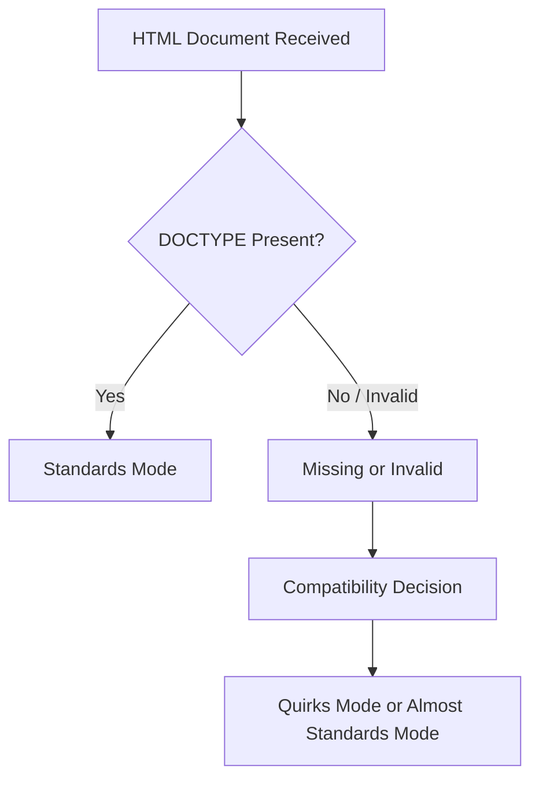
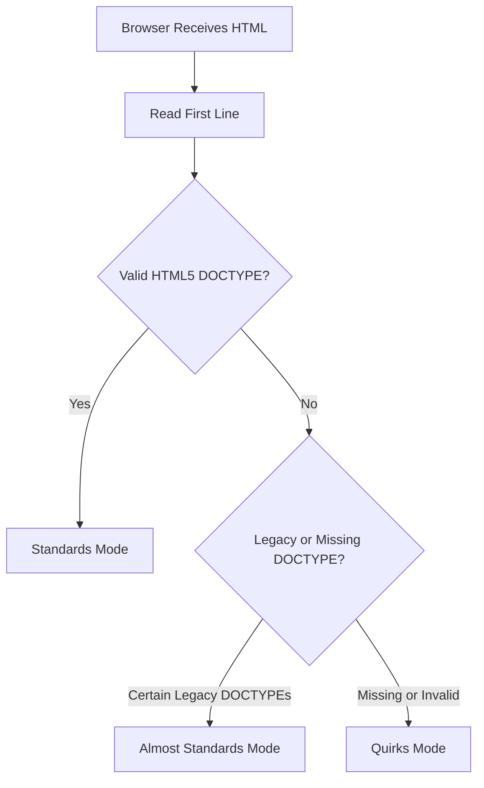
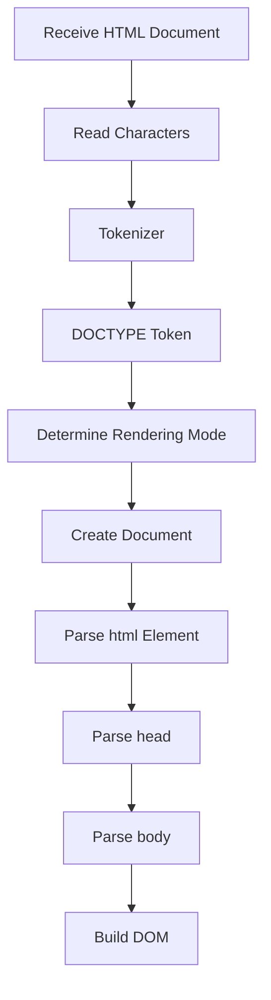

# Chapter 2: `<!DOCTYPE html>`

> **Series:** The Complete HTML Reference: A–Z Guide for Modern Web Development

---

# At a Glance

| Property                     | Value                                |
| ---------------------------- | ------------------------------------ |
| Name                         | `<!DOCTYPE html>`                    |
| Type                         | Document Type Declaration            |
| HTML Element?                | No                                   |
| Requires Closing Tag?        | No                                   |
| Visible on Webpage?          | No                                   |
| Required in HTML5?           | Yes (Recommended for standards mode) |
| First Line of HTML Document? | Yes                                  |

---

# What You'll Learn

By the end of this chapter, you will understand:

* What `<!DOCTYPE html>` really is
* Why it exists
* Why it is **not** an HTML element
* Why every HTML document starts with it
* How browsers use it
* The history of DOCTYPE declarations
* The connection between SGML and HTML
* Standards Mode
* Almost Standards Mode
* Quirks Mode
* Common misconceptions
* Best practices followed by professional developers

---

## Introduction

Open almost any HTML file on the Internet and you'll see the following line at the very top:

```html
<!DOCTYPE html>
```

Most tutorials explain it in a single sentence:

> "It tells the browser this is an HTML5 document."

While technically correct, that explanation barely scratches the surface.

This tiny declaration has a fascinating history that stretches back to the early days of HTML and the evolution of web browsers.

Understanding **why it exists** helps you understand **how browsers decide to interpret your entire webpage**.

---

## What Is `<!DOCTYPE html>`?

`<!DOCTYPE html>` is a **Document Type Declaration (DTD declaration)**.

Its purpose is to inform the browser which HTML standard should be used when interpreting the document.

Unlike most lines in an HTML document:

* It is **not** an HTML element.
* It is **not** displayed in the browser.
* It is **not** part of the DOM.
* It does **not** contain content.

Instead, it acts as an instruction to the browser **before HTML parsing begins**.

---

## Why Isn't It an HTML Element?

Consider a normal HTML element:

```html
<p>Hello World</p>
```

This consists of:

* Opening tag
* Content
* Closing tag

Now compare it with:

```html
<!DOCTYPE html>
```

Notice the differences:

* It has no opening tag.
* It has no closing tag.
* It has no content.
* It cannot have child elements.

Because of these characteristics, it is classified as a **declaration**, not an HTML element.

---

## Where Must It Be Placed?

The DOCTYPE declaration **must appear before the `<html>` element**.

Correct:

```html
<!DOCTYPE html>
<html lang="en">
...
</html>
```

Incorrect:

```html
<html>

<!DOCTYPE html>

...
</html>
```

Browsers expect to encounter the declaration before they begin interpreting the HTML document.

---

## Why Is It the First Line?

The browser reads an HTML document from top to bottom.

Before parsing the HTML itself, the browser needs to determine:

* Which parsing rules to use
* Which rendering mode to activate
* Whether to follow modern standards or compatibility behavior

The DOCTYPE declaration provides that information immediately.

For this reason, it should always be the first line in the document (except for an optional UTF-8 Byte Order Mark, if present).

---

## The Browser's Decision Process

When a browser receives an HTML document, one of the first things it checks is whether a valid DOCTYPE declaration is present.



A correct DOCTYPE encourages the browser to use **Standards Mode**, where modern HTML and CSS specifications are followed as closely as possible.

---

## Think of DOCTYPE as a Rule Book

Imagine you're about to play a game.

Before the game starts, everyone agrees on which rule book to use.

Without that agreement, each player might interpret the rules differently.

DOCTYPE serves a similar purpose for browsers.

It tells the browser:

> "Use the modern HTML rule book when interpreting this document."

---

## What Happens If You Omit It?

Modern browsers are remarkably forgiving.

If you remove the DOCTYPE declaration, the page may still appear to work.

However, the browser may switch to a compatibility mode intended for older websites.

This can affect:

* CSS layout
* Element sizing
* Rendering behavior
* Legacy compatibility

Although the differences may not always be obvious, omitting the DOCTYPE can introduce subtle bugs that are difficult to diagnose.

---

## A Practical Example

With DOCTYPE:

```html
<!DOCTYPE html>
<html>
<head>
    <title>Example</title>
</head>
<body>

<h1>Hello!</h1>

</body>
</html>
```

Without DOCTYPE:

```html
<html>
<head>
    <title>Example</title>
</head>
<body>

<h1>Hello!</h1>

</body>
</html>
```

Both pages may look similar in a modern browser, but internally the browser may use different rendering behavior depending on the document mode.

---

# Did You Know?

> The DOCTYPE declaration is one of the few lines in an HTML document that users never see, yet it influences how the browser interprets the entire page.

---

# Summary

In this first section of Chapter 2, you learned:

* `<!DOCTYPE html>` is a declaration—not an HTML element.
* It appears before the `<html>` element.
* It helps browsers choose the correct rendering mode.
* It is not displayed on the webpage.
* It is not part of the DOM.
* Every modern HTML document should begin with it.

---

## Coming Up Next

In the next section of Chapter 2, we'll explore the fascinating history behind DOCTYPE, including:

* What SGML is
* Why early HTML required complex DOCTYPE declarations
* HTML 2.0, HTML 3.2, and HTML 4.01 DOCTYPEs
* XHTML DOCTYPEs
* Why HTML5 simplified everything to:

```html
<!DOCTYPE html>
```

You'll also discover why this seemingly simple declaration is the result of decades of web evolution.

---

# The History of DOCTYPE

To understand why modern HTML uses the simple declaration:

```html
<!DOCTYPE html>
```

we need to travel back to the origins of HTML itself.

The history of DOCTYPE is closely connected to another technology called **SGML**.

Without understanding SGML, it's difficult to appreciate why early HTML documents contained long and complicated DOCTYPE declarations.

---

# Before HTML: The Need for Structured Documents

In the 1970s and 1980s, organizations such as governments, publishers, and research institutions needed a reliable way to store and exchange large documents.

These documents included:

* Technical manuals
* Scientific papers
* Legal documents
* Military documentation
* Books
* Engineering specifications

The challenge was that every computer system stored documents differently.

A document created on one system often could not be processed correctly on another.

There was a need for a universal way to describe a document's **structure** rather than its appearance.

---

## Enter SGML

**SGML** stands for **Standard Generalized Markup Language**.

It became an international standard in **1986**.

Unlike HTML, SGML was not designed specifically for web pages.

Instead, it was a powerful system for defining custom markup languages.

In other words:

> SGML was a language used to create other markup languages.

HTML eventually became one of those markup languages.

---

# A Family Tree of Markup Languages

The relationship between SGML and HTML can be visualized like this:

```text
SGML (1986)
│
├── HTML
│
├── XML
│
├── DocBook
│
├── MathML
│
└── Many other markup languages
```

SGML acted as the parent language from which many specialized markup languages were developed.

---

## Why SGML Needed a DOCTYPE

One of SGML's strengths was flexibility.

Different organizations could define different sets of elements for different purposes.

For example:

* A publishing company might define elements for chapters and books.
* A medical organization might define elements for patient records.
* An engineering company might define elements for technical specifications.

Because SGML documents could use completely different element sets, every document had to identify **which rules it followed**.

This identification was done using a **Document Type Declaration (DOCTYPE)**.

---

# What Is a DTD?

A **DTD** stands for **Document Type Definition**.

A DTD describes:

* Which elements are allowed
* Which attributes are allowed
* Which elements may contain other elements
* The overall structure of the document

Think of a DTD as a blueprint or rule book for a particular type of document.

When an SGML parser encountered a document, it could consult the DTD to determine whether the document was valid.

---

# HTML Inherits the Idea

When HTML was created, it inherited this concept from SGML.

Early versions of HTML were defined using SGML rules.

As a result, HTML documents also included DOCTYPE declarations that referenced specific DTDs.

These declarations were much longer than the modern HTML5 version.

---

## HTML 2.0 DOCTYPE

One of the earliest standardized HTML versions was **HTML 2.0**.

A simplified DOCTYPE looked similar to:

```html
<!DOCTYPE HTML PUBLIC "-//IETF//DTD HTML 2.0//EN">
```

Although it appears intimidating today, every part of the declaration had a purpose.

It identified:

* The markup language
* The organization responsible for the specification
* The version of HTML
* The language of the DTD

At the time, browsers and validators relied on this information.

---

## HTML 3.2 DOCTYPE

As HTML evolved, so did the DOCTYPE declaration.

HTML 3.2 used declarations similar to:

```html
<!DOCTYPE HTML PUBLIC "-//W3C//DTD HTML 3.2 Final//EN">
```

Compared to HTML 2.0:

* The governing organization had changed.
* The specification had expanded.
* More elements were supported.

Despite these improvements, the declaration remained lengthy.

---

## HTML 4.01 DOCTYPE

HTML 4.01 introduced three different document types.

Each served a different purpose.

## Strict

```html
<!DOCTYPE HTML PUBLIC "-//W3C//DTD HTML 4.01//EN"
"http://www.w3.org/TR/html4/strict.dtd">
```

The Strict DTD encouraged developers to separate structure from presentation.

Presentation-related elements such as `<font>` were discouraged.

---

## Transitional

```html
<!DOCTYPE HTML PUBLIC "-//W3C//DTD HTML 4.01 Transitional//EN"
"http://www.w3.org/TR/html4/loose.dtd">
```

The Transitional DTD allowed older presentation elements so developers could migrate existing websites gradually.

---

## Frameset

```html
<!DOCTYPE HTML PUBLIC "-//W3C//DTD HTML 4.01 Frameset//EN"
"http://www.w3.org/TR/html4/frameset.dtd">
```

This version supported HTML frames, which were widely used before modern layout techniques became common.

---

# Why Were There So Many Versions?

During the late 1990s and early 2000s, browser vendors implemented HTML differently.

Web developers often needed to choose a DOCTYPE that matched the features they intended to use.

The DOCTYPE helped browsers understand which behavior was expected.

---

## XHTML and Even Stricter Rules

After HTML 4.01 came XHTML.

XHTML combined HTML with XML syntax rules.

A typical XHTML DOCTYPE looked like this:

```html
<!DOCTYPE html PUBLIC
"-//W3C//DTD XHTML 1.0 Strict//EN"
"http://www.w3.org/TR/xhtml1/DTD/xhtml1-strict.dtd">
```

Compared to HTML 4.01, XHTML required developers to write perfectly well-formed documents.

For example:

* Every element had to be closed.
* Element names had to be lowercase.
* Attribute values required quotation marks.
* Elements had to be nested correctly.

While XHTML promoted cleaner code, many developers found it unnecessarily strict for everyday web development.

---

## The Arrival of HTML5

By the late 2000s, browsers had become far more capable.

Developers no longer needed complicated SGML-based declarations.

HTML itself had also evolved beyond its SGML roots.

The creators of HTML5 made an important decision:

> Simplify the DOCTYPE.

Instead of requiring long declarations that referenced external DTDs, HTML5 introduced a remarkably simple declaration:

```html
<!DOCTYPE html>
```

That's all.

No URLs.

No public identifiers.

No DTD references.

No version numbers.

Simple, readable, and easy to remember.

---

## Why HTML5 Simplified Everything

HTML5 no longer depends on SGML.

Because of this, browsers no longer need to download or consult external DTD files when parsing HTML documents.

The simplified declaration has several advantages:

* Easy to remember
* Easy to type
* Less prone to errors
* Faster for developers to write
* Encourages consistent browser behavior

This is one of the reasons modern HTML is much more approachable than earlier versions.

---

## Evolution of DOCTYPE

```text
1986
│
├── SGML Standard
│
1993
│
├── HTML 1.x
│
1995
│
├── HTML 2.0
│
1997
│
├── HTML 3.2
│
1999
│
├── HTML 4.01
│
2000
│
├── XHTML
│
2014
│
└── HTML5
        │
        └── <!DOCTYPE html>
```

---

# Did You Know?

> The modern HTML5 DOCTYPE is one of the shortest declarations in the history of HTML, yet it replaced decades of much longer and more complex declarations inherited from SGML.

---

# Summary

In this section, you learned:

* Why SGML existed before HTML.
* What a DTD is.
* Why early HTML required long DOCTYPE declarations.
* The evolution from HTML 2.0 through XHTML.
* Why HTML5 abandoned SGML-based DTDs.
* Why modern HTML uses the simple `<!DOCTYPE html>` declaration.

---

## Coming Up Next

In the next section of Chapter 2, we'll explore one of the most important browser concepts related to DOCTYPE:

* Standards Mode
* Quirks Mode
* Almost Standards Mode
* How browsers choose a rendering mode
* Real-world rendering differences
* Why missing or incorrect DOCTYPE declarations can break layouts

Understanding these rendering modes will help you write HTML that behaves consistently across modern browsers.

---

# Browser Rendering Modes

One of the primary reasons `<!DOCTYPE html>` exists today is to help browsers decide **how to render a webpage**.

When a browser begins reading an HTML document, it doesn't immediately start drawing the page.

Instead, one of its first tasks is to determine which **rendering mode** should be used.

This decision affects how HTML and CSS are interpreted.

A modern browser can operate in three rendering modes:

1. **Standards Mode**
2. **Almost Standards Mode**
3. **Quirks Mode**

Choosing the correct mode helps ensure that a webpage behaves consistently across different browsers.

---

# Why Rendering Modes Exist

In the early years of the web, browsers often implemented HTML and CSS differently.

Developers frequently created websites that worked correctly in only one browser.

When browser vendors later improved their standards support, many older websites broke because they relied on browser-specific behavior.

To solve this problem, browser developers introduced rendering modes.

These modes allowed browsers to support:

* Modern websites using current standards.
* Older websites that depended on historical browser behavior.

This balance made it possible for the web to evolve without making millions of existing pages unusable.

---

## Standards Mode

**Standards Mode** is the rendering mode every modern webpage should use.

When a browser enters Standards Mode, it follows the current HTML and CSS specifications as closely as possible.

Characteristics of Standards Mode include:

* Modern HTML parsing
* Modern CSS layout
* Consistent box model calculations
* Better interoperability across browsers
* Improved accessibility support
* Predictable rendering

A valid HTML5 DOCTYPE declaration is the simplest way to activate Standards Mode.

Example:

```html
<!DOCTYPE html>
<html lang="en">
<head>
    <meta charset="UTF-8">
    <title>Standards Mode</title>
</head>
<body>

<h1>Hello World</h1>

</body>
</html>
```

This document is interpreted using the browser's modern rendering engine.

---

## Quirks Mode

**Quirks Mode** is a compatibility mode.

It exists primarily to support webpages created before modern web standards became widely adopted.

When Quirks Mode is enabled, browsers intentionally reproduce certain historical behaviors—even if those behaviors are no longer considered correct.

Examples of legacy behaviors include:

* Older box model calculations
* Legacy table rendering
* Browser-specific layout quirks
* Historical CSS interpretation

Without Quirks Mode, many old websites would display incorrectly.

---

# What Triggers Quirks Mode?

The most common causes include:

* Missing DOCTYPE declaration
* Invalid DOCTYPE declaration
* Certain obsolete DOCTYPE declarations

For example:

```html
<html>
<head>
    <title>No DOCTYPE</title>
</head>
<body>

<p>Hello</p>

</body>
</html>
```

Although this page may appear acceptable in a modern browser, the browser can switch to Quirks Mode because no valid DOCTYPE was found.

---

## Almost Standards Mode

Between Standards Mode and Quirks Mode lies **Almost Standards Mode**.

This mode behaves almost identically to Standards Mode, with only a few compatibility adjustments retained for historical reasons.

Today, the differences are minimal and primarily relate to certain legacy layout behaviors.

Most developers will rarely encounter Almost Standards Mode directly, but browsers continue to support it for compatibility.

---

# Comparing the Three Modes

| Feature                        | Standards Mode | Almost Standards Mode | Quirks Mode                    |
| ------------------------------ | -------------- | --------------------- | ------------------------------ |
| Modern HTML parsing            | Yes            | Yes                   | Limited compatibility behavior |
| Modern CSS support             | Yes            | Yes                   | Legacy behavior may apply      |
| Recommended for new websites   | Yes            | No                    | No                             |
| Triggered by `<!DOCTYPE html>` | Yes            | No                    | No                             |
| Intended for legacy websites   | No             | Occasionally          | Yes                            |

---

## How Browsers Choose a Rendering Mode

When a browser receives an HTML document, it performs an early evaluation.

The process can be summarized as follows.



Although each browser has its own implementation details, the overall decision-making process is very similar across modern browsers.

---

# A Practical Comparison

Let's compare two nearly identical documents.

### Example 1: With DOCTYPE

```html
<!DOCTYPE html>
<html>
<head>
    <title>Example</title>
</head>
<body>

<h1>Modern HTML</h1>

</body>
</html>
```

Result:

* Standards Mode
* Predictable layout
* Modern CSS behavior

---

### Example 2: Without DOCTYPE

```html
<html>
<head>
    <title>Example</title>
</head>
<body>

<h1>Legacy HTML</h1>

</body>
</html>
```

Possible result:

* Quirks Mode
* Compatibility behavior
* Older layout calculations

Although both pages may look similar, subtle differences can appear when CSS becomes more complex.

---

# The CSS Box Model Example

One of the most famous differences between Standards Mode and Quirks Mode involves the **CSS box model**.

Suppose you write:

```css
.box {
    width: 300px;
    padding: 20px;
    border: 10px solid black;
}
```

### Standards Mode

The browser interprets the values according to the modern CSS specification.

```text
Content Width : 300px
Padding       : 20px + 20px
Border        : 10px + 10px

Total Width = 360px
```

### Quirks Mode

Older browsers often treated the declared width as including padding and borders.

This resulted in different layout calculations.

The difference caused countless layout issues during the early years of web development.

---

# How to Check the Current Rendering Mode

Most modern browsers include Developer Tools.

After opening Developer Tools, you can inspect the page and determine whether the browser is using:

* Standards Mode
* Almost Standards Mode
* Quirks Mode

This information is especially useful when debugging older websites.

---

# Why Modern Developers Rarely See Quirks Mode

Today, nearly every HTML document begins with:

```html
<!DOCTYPE html>
```

As a result, modern browsers almost always enter Standards Mode automatically.

Quirks Mode mainly exists to preserve compatibility with websites created many years ago.

---

# Best Practices

To ensure consistent rendering across browsers:

* Always place `<!DOCTYPE html>` on the first line.
* Use valid HTML.
* Avoid obsolete DOCTYPE declarations.
* Test pages in multiple browsers.
* Validate your HTML regularly.

Following these practices minimizes rendering inconsistencies.

---

# Did You Know?

> Browser vendors continue to maintain Quirks Mode primarily because millions of archived or legacy webpages still depend on historical browser behavior.

Removing Quirks Mode entirely would cause many older websites to render incorrectly.

---

# Summary

In this section, you learned:

* Why rendering modes exist.
* The purpose of Standards Mode.
* The purpose of Quirks Mode.
* The role of Almost Standards Mode.
* How browsers choose a rendering mode.
* Why `<!DOCTYPE html>` helps activate Standards Mode.
* Why modern developers should always target Standards Mode.

---

## Coming Up Next

In the next section of Chapter 2, we'll move deeper into browser internals by exploring:

* How the HTML parser processes `<!DOCTYPE html>`
* Why the declaration is **not** part of the DOM
* Tokenization and parsing
* Browser parsing stages
* What happens before the `<html>` element is read
* Parser algorithms defined by the HTML Living Standard

This will give you a behind-the-scenes understanding of what the browser does before it even begins building the document tree.

---

# Browser Internals: How the HTML Parser Handles `<!DOCTYPE html>`

In the previous section, you learned that `<!DOCTYPE html>` influences the browser's rendering mode.

Now let's go one step deeper.

Instead of asking **what** the DOCTYPE does, we'll answer **how** the browser processes it internally.

Understanding this process provides valuable insight into how modern browsers transform plain text into an interactive webpage.

---

## The Browser Receives an HTML Document

When you request a webpage, the server sends an HTML document to your browser.

Remember:

> An HTML document is simply a text file.

For example:

```html
<!DOCTYPE html>
<html lang="en">

<head>
    <title>My Website</title>
</head>

<body>

<h1>Hello World</h1>

</body>

</html>
```

At this stage, the browser does **not** yet know anything about:

* Elements
* Headings
* Paragraphs
* Images
* Links

It only sees a stream of characters.

---

## Stage 1: Reading Characters

The browser begins reading the document from the first character.

Imagine the document as a sequence of symbols:

```text
< ! D O C T Y P E h t m l >

< h t m l >

< h e a d >

...
```

The browser processes these characters one by one.

This process is extremely fast and highly optimized.

---

## Stage 2: Tokenization

The next step is called **tokenization**.

Tokenization means converting raw characters into meaningful units called **tokens**.

For example:

```html
<!DOCTYPE html>
```

is recognized as a **DOCTYPE token**.

Similarly,

```html
<html>
```

becomes a **Start Tag token**.

```html
</html>
```

becomes an **End Tag token**.

Text between elements becomes **Character tokens**.

---

# Common HTML Tokens

During parsing, browsers generate different types of tokens.

| Token Type      | Example            |
| --------------- | ------------------ |
| DOCTYPE Token   | `<!DOCTYPE html>`  |
| Start Tag Token | `<body>`           |
| End Tag Token   | `</body>`          |
| Comment Token   | `<!-- comment -->` |
| Character Token | `Hello World`      |
| EOF Token       | End of File        |

These tokens are processed one after another.

---

## Stage 3: Processing the DOCTYPE Token

The very first significant token is usually the DOCTYPE token.

When the browser encounters:

```html
<!DOCTYPE html>
```

it performs several checks.

The browser asks questions such as:

* Is this a valid DOCTYPE?
* Is it an HTML5 DOCTYPE?
* Should Standards Mode be enabled?
* Should compatibility mode be used?

Notice something important:

The browser is making these decisions **before** it begins constructing the document tree.

---

# Why This Happens First

The browser needs to know which parsing and rendering rules should be followed.

Imagine trying to assemble a machine without knowing which instruction manual to use.

The browser avoids this problem by evaluating the DOCTYPE immediately.

Only after determining the rendering mode does it continue parsing the rest of the document.

---

## Stage 4: Creating the Document Object

Once the rendering mode has been selected, the browser creates an internal **Document object**.

Think of this object as the root container for everything that follows.

Initially, it is almost empty.

```text
Document
```

As more HTML is parsed, additional nodes are attached to this document.

---

## Stage 5: Parsing the `<html>` Element

Next, the browser encounters:

```html
<html lang="en">
```

A new **HTML element node** is created.

The internal structure now becomes:

```text
Document
│
└── html
```

The browser continues expanding this structure as it reads more elements.

---

## Stage 6: Parsing the `<head>` Element

When the parser reaches:

```html
<head>
```

another node is created.

```text
Document
│
└── html
    │
    └── head
```

The browser then processes everything inside the `<head>` element, including:

* `<meta>`
* `<title>`
* `<link>`
* `<style>`
* `<script>`

---

## Stage 7: Parsing the `<body>` Element

Eventually, the parser reaches:

```html
<body>
```

The internal structure grows again.

```text
Document
│
└── html
    │
    ├── head
    │
    └── body
```

From this point onward, visible page content is added beneath the `<body>` node.

---

# The DOM Is Built Incrementally

The browser does **not** wait until the entire file has been downloaded before constructing the DOM.

Instead, it builds the DOM **incrementally**.

As each element is parsed:

* A node is created.
* The node is attached to its parent.
* The DOM grows continuously.

This allows browsers to begin rendering parts of the page before the entire document has finished downloading.

---

# Is the DOCTYPE Part of the DOM?

One of the most common questions is:

> "Does `<!DOCTYPE html>` become an HTML element in the DOM?"

The answer is:

**No.**

The DOCTYPE declaration is **not** an HTML element.

It is **not** represented as an element node within the DOM tree.

Instead, it is processed separately before normal HTML parsing begins.

Conceptually:

```text
DOCTYPE
        │
        ▼

Rendering Mode Selected

        │
        ▼

DOM Construction Begins
```

This separation is one of the reasons the DOCTYPE is classified as a declaration rather than an HTML element.

---

## Simplified Parsing Workflow

The browser's workflow can be summarized as follows.



Although modern browser engines are far more sophisticated, this diagram captures the fundamental sequence.

---

## What Happens If the DOCTYPE Is Invalid?

Suppose the browser encounters an invalid or malformed declaration.

Instead of entering Standards Mode, it may switch to:

* Almost Standards Mode
* Quirks Mode

The exact behavior depends on the declaration and the browser's compatibility rules.

This is why copying obsolete DOCTYPE declarations from old websites is discouraged.

---

# Browser Engines

Different browsers use different rendering engines.

For example:

| Browser         | Rendering Engine |
| --------------- | ---------------- |
| Google Chrome   | Blink            |
| Microsoft Edge  | Blink            |
| Safari          | WebKit           |
| Mozilla Firefox | Gecko            |

Although these engines are implemented differently, they all follow the HTML Living Standard closely when processing a valid HTML5 DOCTYPE.

---

# Did You Know?

> The HTML parser in a modern browser can process **millions of characters per second**, allowing even large HTML documents to be parsed almost instantly on modern hardware.

---

# Summary

In this section, you learned:

* How browsers read HTML as plain text.
* What tokenization is.
* Why `<!DOCTYPE html>` is processed before HTML elements.
* How the browser determines its rendering mode.
* How the Document object is created.
* How the DOM grows incrementally.
* Why the DOCTYPE is not part of the DOM.
* How browser engines handle HTML parsing.

---

## Coming Up Next

In the next section of Chapter 2, we'll explore:

* HTML validation
* Common DOCTYPE mistakes
* Real-world examples
* Browser compatibility
* Frequently asked questions
* Hands-on experiments
* Interview questions
* Chapter summary

After that, **Chapter 2 will be complete**, and we'll begin **Chapter 3: `<html>`**, where we'll explore the root element of every HTML document in complete detail.

---

# HTML Validation and the Role of DOCTYPE

Writing HTML that appears correctly in a browser does not necessarily mean the document is valid.

Modern browsers are designed to recover from many HTML mistakes automatically. While this improves the user experience, it can also hide problems that may affect accessibility, maintainability, browser compatibility, or search engine optimization.

Professional web developers therefore **validate** their HTML.

---

# What Is HTML Validation?

HTML validation is the process of checking whether an HTML document follows the rules defined by the HTML specification.

A validator examines your document and reports issues such as:

* Missing required elements
* Incorrect nesting
* Invalid attributes
* Obsolete elements
* Duplicate IDs
* Syntax errors

Validation does **not** guarantee that a webpage looks beautiful.

Instead, it confirms that your HTML follows the standard correctly.

---

# Why Validation Matters

Valid HTML provides several important benefits.

## Better Browser Consistency

Different browsers interpret invalid HTML differently.

Valid HTML reduces unexpected differences between browsers.

---

## Improved Accessibility

Assistive technologies such as screen readers rely on correct document structure.

Invalid HTML may prevent users with disabilities from navigating a webpage effectively.

---

## Easier Maintenance

Clean, valid HTML is easier to read, understand, and update.

Large projects become much easier to manage when the markup follows consistent standards.

---

## Better SEO

Search engines prefer webpages with well-structured HTML.

Although validation alone does not improve rankings, clean HTML makes it easier for search engines to understand page content.

---

# Does DOCTYPE Validate HTML?

A common misconception is:

> "Adding `<!DOCTYPE html>` makes my HTML valid."

This is **not true**.

The DOCTYPE declaration simply informs the browser which rendering mode should be used.

Consider the following document:

```html
<!DOCTYPE html>

<html>

<head>

<title>Example</title>

</head>

<body>

<h1>Hello

<p>This paragraph is never closed.

</body>

</html>
```

Even though the DOCTYPE is correct, the document still contains HTML errors.

The browser may attempt to repair them automatically, but the document is not valid HTML.

---

# What DOCTYPE Actually Does

It is important to distinguish between these two responsibilities.

| Feature           | Responsibility                                 |
| ----------------- | ---------------------------------------------- |
| `<!DOCTYPE html>` | Selects the browser's rendering mode           |
| HTML Validator    | Checks whether the document follows HTML rules |

They work together, but they perform different tasks.

---

# Common DOCTYPE Mistakes

Let's examine mistakes frequently made by beginners.

---

## Mistake 1: Forgetting the DOCTYPE

Incorrect:

```html
<html>
```

Correct:

```html
<!DOCTYPE html>
<html>
```

Always place the DOCTYPE declaration before the `<html>` element.

---

## Mistake 2: Placing It in the Wrong Location

Incorrect:

```html
<html>

<!DOCTYPE html>

<head>

...
```

The browser expects the declaration before the document begins.

---

## Mistake 3: Copying Old DOCTYPE Declarations

Some older tutorials still show declarations like:

```html
<!DOCTYPE HTML PUBLIC "-//W3C//DTD HTML 4.01 Transitional//EN">
```

For new projects, this should be avoided.

Modern HTML uses:

```html 
<!DOCTYPE html>
```

Nothing more is required.

---

## Mistake 4: Changing the Capitalization

You may encounter:

```html 
<!doctype html>
```

or

```html 
<!DOCTYPE HTML>
```

HTML is generally case-insensitive, so these declarations are accepted by modern browsers.

However, the most common and recommended style is:

```html
<!DOCTYPE html>
```

Using a consistent style improves readability.

---

# Real-World Example

Consider the following webpage.

```html
<!DOCTYPE html>

<html lang="en">

<head>

<meta charset="UTF-8">

<title>Example Website</title>

</head>

<body>

<header>

<h1>My Website</h1>

</header>

<main>

<p>Learning HTML.</p>

</main>

</body>

</html>

```

Notice that:

* The DOCTYPE appears first.
* The `<html>` element follows immediately.
* The document has a clear structure.
* Modern browsers will render it in Standards Mode.

This is the recommended structure for almost every HTML document you create.

---

# Frequently Asked Questions

## Is the DOCTYPE required?

Technically, browsers can display HTML without it.

Practically, every modern HTML document should include it.

---

## Can I place comments before the DOCTYPE?

No.

The DOCTYPE should be the first meaningful declaration in the document.

---

## Can there be more than one DOCTYPE?

No.

An HTML document should contain only one DOCTYPE declaration.

---

## Does the browser display the DOCTYPE?

No.

It is processed internally by the browser.

Users never see it on the webpage.

---

## Is `<!DOCTYPE html>` different in Chrome, Firefox, Safari, and Edge?

No.

Modern browsers all recognize the HTML5 DOCTYPE and use it to activate Standards Mode.

---

## Can JavaScript change the DOCTYPE?

No.

The browser processes the DOCTYPE before building the document.

By the time JavaScript begins executing, the rendering mode has already been selected.

---

# Hands-on Experiment

Let's perform a simple experiment.

Create a file named:

```text
doctype-test.html
```

Add the following code:

```html
<!DOCTYPE html>

<html lang="en">

<head>

<meta charset="UTF-8">

<title>DOCTYPE Test</title>

<style>

body {

font-family: Arial, sans-serif;

margin: 40px;

}

.box {

width: 300px;

padding: 20px;

border: 10px solid steelblue;

background: lightyellow;

}

</style>

</head>

<body>

<div class="box">

This box is rendered in Standards Mode.

</div>

</body>

</html>
```

Now save the file and open it in your browser.

Next, create another copy of the file.

Remove only this line:

```html 
<!DOCTYPE html>
```

Open the second file.

The two pages may appear similar, but internally the browser may choose a different rendering mode.

This simple experiment demonstrates how one line can influence the browser before any HTML elements are processed.

---

# Best Practices

Professional developers follow these recommendations.

* Always use the HTML5 DOCTYPE.
* Place it on the first line.
* Never copy obsolete DOCTYPE declarations.
* Validate your HTML regularly.
* Keep your document structure clean.
* Write semantic HTML.
* Test pages in multiple browsers.

These habits will help you create reliable and future-proof webpages.

---

# Did You Know?

> Even though `<!DOCTYPE html>` contains only **15 characters**, it influences how browsers interpret every line that follows.

It is one of the shortest—and most important—declarations in modern web development.

---

# Quick Revision

Before moving to the next chapter, make sure you can answer these questions without looking back.

* What is a DOCTYPE?
* Is `<!DOCTYPE html>` an HTML element?
* Why does it appear before `<html>`?
* What is Standards Mode?
* What is Quirks Mode?
* What is Almost Standards Mode?
* Why was HTML5's DOCTYPE simplified?
* Is the DOCTYPE part of the DOM?
* Does the DOCTYPE validate HTML?
* What happens if it is omitted?

If you can confidently answer these questions, you have mastered one of the most fundamental concepts in HTML.

---

## Coming Up Next

In the final section of Chapter 2, we'll complete the chapter with:

* Practical interview questions
* Coding exercises
* Mini project
* Chapter summary
* Quick reference sheet
* Key takeaways

After that, we'll begin **Chapter 3: `<html>`**, where we'll study the root element of every HTML document from the HTML Living Standard down to browser implementation details.

---

# Practice Exercises

The best way to understand `<!DOCTYPE html>` is to experiment with it yourself.

Complete the following exercises using a text editor such as **Notepad++**, **Visual Studio Code**, or any other HTML editor.

---

## Exercise 1: Create Your First HTML5 Document

Create a new file named:

```text
exercise-01.html
```

Write a complete HTML5 document using the correct DOCTYPE declaration.

Requirements:

* Include `<!DOCTYPE html>`
* Add the `<html>` element with the `lang` attribute.
* Add a `<head>` section.
* Include a `<title>`.
* Create a `<body>` with one heading and one paragraph.

Open the file in your browser and verify that it displays correctly.

---

## Exercise 2: Compare With and Without DOCTYPE

Create two files.

### File A

Contains:

```html
<!DOCTYPE html>
```

### File B

Contains no DOCTYPE declaration.

Open both files in your browser.

Use the browser's Developer Tools to inspect each page and compare the document mode if available.

Ask yourself:

* Do both pages look the same?
* Why might browsers still treat them differently?

---

## Exercise 3: Read Existing Websites

Visit three different websites.

View the page source.

Try to locate:

* The DOCTYPE declaration
* The `<html>` element
* The `<head>` section
* The `<body>` section

Observe whether all modern websites begin with:

```html
<!DOCTYPE html>
```

---

## Exercise 4: Identify Errors

Study the following code.

```html
<html>

<head>

<title>Example</title>

</head>

<body>

<h1>Hello

</body>

</html>
```

Questions:

1. Is the DOCTYPE present?
2. Which rendering mode may the browser choose?
3. Is the heading properly closed?
4. Is this valid HTML?

Correct the document and compare your solution with the HTML specification.

---

# Mini Project

Now it's time to apply everything you've learned.

Create a file named:

```text
modern-html-template.html
```

Add the following code.

```html
<!DOCTYPE html>
<html lang="en">

<head>

<meta charset="UTF-8">

<meta name="viewport"
      content="width=device-width, initial-scale=1.0">

<title>Modern HTML Template</title>

</head>

<body>

<header>

<h1>Welcome</h1>

</header>

<main>

<section>

<h2>About HTML</h2>

<p>
HTML is the standard markup language for creating web pages.
</p>

</section>

</main>

<footer>

<p>Copyright © 2026</p>

</footer>

</body>

</html>
```

After saving the file:

1. Open it in your browser.
2. Inspect the page using Developer Tools.
3. Confirm that the browser is using Standards Mode.
4. Modify the page by changing the heading, title, and paragraph.

This exercise reinforces the proper placement and purpose of the DOCTYPE declaration.

---

# Common Interview Questions

The following questions are frequently asked during web development interviews.

## Beginner Level

### 1. What does `<!DOCTYPE html>` do?

**Answer:**

It tells the browser to render the document using modern HTML standards (Standards Mode).

---

### 2. Is `<!DOCTYPE html>` an HTML element?

**Answer:**

No.

It is a document type declaration and not an HTML element.

---

### 3. Where should the DOCTYPE declaration be placed?

**Answer:**

At the very beginning of the HTML document, before the `<html>` element.

---

### 4. Is a closing tag required?

**Answer:**

No.

The DOCTYPE declaration is not an element and therefore has no closing tag.

---

### 5. Can a webpage work without it?

**Answer:**

Yes.

However, the browser may switch to Quirks Mode, which can lead to inconsistent rendering.

---

## Intermediate Level

### 6. What is Quirks Mode?

A browser compatibility mode that reproduces certain historical rendering behaviors for older webpages.

---

### 7. What is Standards Mode?

The browser follows modern HTML and CSS specifications as closely as possible.

---

### 8. What is Almost Standards Mode?

A compatibility mode that behaves almost like Standards Mode while preserving a few historical layout behaviors.

---

### 9. Is the DOCTYPE included in the DOM?

No.

The browser processes it before constructing the DOM.

---

### 10. Does DOCTYPE validate HTML?

No.

Validation is performed by HTML validators, not by the DOCTYPE declaration itself.

---

## Advanced Level

### 11. Why did HTML5 simplify the DOCTYPE?

Because HTML5 no longer depends on SGML-based DTDs, making long declarations unnecessary.

---

### 12. At what stage does the browser process the DOCTYPE?

During the initial parsing phase, before constructing the DOM tree.

---

### 13. Why is the DOCTYPE important for CSS?

Because the rendering mode selected by the browser affects how CSS is interpreted and applied.

---

### 14. Can JavaScript modify the DOCTYPE after the page loads?

No.

The rendering mode has already been determined before JavaScript executes.

---

### 15. Why is `<!DOCTYPE html>` considered future-proof?

It is defined by the HTML Living Standard and is recognized consistently by all modern browsers.

---

# Quick Reference Sheet

| Property       | Value                      |
| -------------- | -------------------------- |
| Declaration    | `<!DOCTYPE html>`          |
| Type           | Document Type Declaration  |
| HTML Element   | No                         |
| Visible        | No                         |
| Closing Tag    | No                         |
| Appears in DOM | No                         |
| Position       | First line of the document |
| Purpose        | Activates Standards Mode   |
| HTML5 Syntax   | `<!DOCTYPE html>`          |
| Recommended    | Always                     |

---

# Key Takeaways

Before moving to the next chapter, remember these important points.

* `<!DOCTYPE html>` is **not** an HTML element.
* It is processed before the browser parses the HTML document.
* It helps the browser choose the correct rendering mode.
* HTML5 uses a simple declaration because it no longer relies on SGML.
* Every modern HTML document should begin with `<!DOCTYPE html>`.
* The DOCTYPE itself does not validate HTML.
* A valid DOCTYPE improves browser consistency and standards compliance.

---

# Chapter 2 Summary

Congratulations!

You have completed one of the most important chapters in this book.

Although `<!DOCTYPE html>` consists of only a single line, you have learned that it plays a vital role in modern web development.

In this chapter, you explored:

* The definition of a DOCTYPE
* Why `<!DOCTYPE html>` is not an HTML element
* The history of SGML and DTDs
* The evolution of HTML DOCTYPE declarations
* HTML 2.0, HTML 3.2, HTML 4.01, XHTML, and HTML5
* Standards Mode
* Almost Standards Mode
* Quirks Mode
* Browser parsing and tokenization
* DOM construction
* HTML validation
* Common mistakes
* Best practices
* Practical experiments
* Interview questions
* Exercises and a mini project

You now have a deep understanding of one of the smallest—but most influential—declarations in every HTML document.

---

# Looking Ahead

In **Chapter 3**, we'll begin exploring the first true HTML element:

```html
<html>
```

This chapter will answer questions such as:

* Why is `<html>` called the root element?
* What does the browser create when it encounters `<html>`?
* What are its content model and permitted children?
* Which global and element-specific attributes does it support?
* What does the `lang` attribute actually do?
* How does `<html>` affect accessibility, SEO, internationalization, and browser behavior?

We'll also examine the `<html>` element from the perspective of the HTML Living Standard, browser engines, and the Document Object Model.

---

> **End of Chapter 2**
