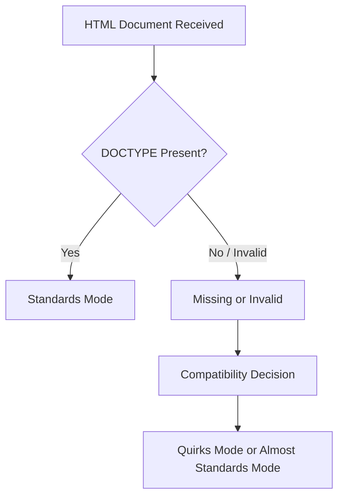

# Chapter 2: `<!DOCTYPE html>`

> **Series:** The Complete HTML Reference: A–Z Guide for Modern Web Development

---

# At a Glance

| Property                     | Value                                  |
| ---------------------------- | -------------------------------------- |
| Name                         | `<!DOCTYPE html>`                      |
| Type                         | Document Type Declaration              |
| HTML Element?                | ❌ No                                   |
| Requires Closing Tag?        | ❌ No                                   |
| Visible on Webpage?          | ❌ No                                   |
| Required in HTML5?           | ✅ Yes (Recommended for standards mode) |
| First Line of HTML Document? | ✅ Yes                                  |

---

# What You'll Learn

By the end of this chapter, you will understand:

* What `<!DOCTYPE html>` really is
* Why it exists
* Why it is **not** an HTML element
* Why every HTML document starts with it
* How browsers use it
* The history of DOCTYPE declarations
* The connection between SGML and HTML
* Standards Mode
* Almost Standards Mode
* Quirks Mode
* Common misconceptions
* Best practices followed by professional developers

---

## Introduction

Open almost any HTML file on the Internet and you'll see the following line at the very top:

```html
<!DOCTYPE html>
```

Most tutorials explain it in a single sentence:

> "It tells the browser this is an HTML5 document."

While technically correct, that explanation barely scratches the surface.

This tiny declaration has a fascinating history that stretches back to the early days of HTML and the evolution of web browsers.

Understanding **why it exists** helps you understand **how browsers decide to interpret your entire webpage**.

---

## What Is `<!DOCTYPE html>`?

`<!DOCTYPE html>` is a **Document Type Declaration (DTD declaration)**.

Its purpose is to inform the browser which HTML standard should be used when interpreting the document.

Unlike most lines in an HTML document:

* It is **not** an HTML element.
* It is **not** displayed in the browser.
* It is **not** part of the DOM.
* It does **not** contain content.

Instead, it acts as an instruction to the browser **before HTML parsing begins**.

---

## Why Isn't It an HTML Element?

Consider a normal HTML element:

```html
<p>Hello World</p>
```

This consists of:

* Opening tag
* Content
* Closing tag

Now compare it with:

```html
<!DOCTYPE html>
```

Notice the differences:

* It has no opening tag.
* It has no closing tag.
* It has no content.
* It cannot have child elements.

Because of these characteristics, it is classified as a **declaration**, not an HTML element.

---

## Where Must It Be Placed?

The DOCTYPE declaration **must appear before the `<html>` element**.

Correct:

```html
<!DOCTYPE html>
<html lang="en">
...
</html>
```

Incorrect:

```html
<html>

<!DOCTYPE html>

...
</html>
```

Browsers expect to encounter the declaration before they begin interpreting the HTML document.

---

## Why Is It the First Line?

The browser reads an HTML document from top to bottom.

Before parsing the HTML itself, the browser needs to determine:

* Which parsing rules to use
* Which rendering mode to activate
* Whether to follow modern standards or compatibility behavior

The DOCTYPE declaration provides that information immediately.

For this reason, it should always be the first line in the document (except for an optional UTF-8 Byte Order Mark, if present).

---

## The Browser's Decision Process

When a browser receives an HTML document, one of the first things it checks is whether a valid DOCTYPE declaration is present.



A correct DOCTYPE encourages the browser to use **Standards Mode**, where modern HTML and CSS specifications are followed as closely as possible.

---

## Think of DOCTYPE as a Rule Book

Imagine you're about to play a game.

Before the game starts, everyone agrees on which rule book to use.

Without that agreement, each player might interpret the rules differently.

DOCTYPE serves a similar purpose for browsers.

It tells the browser:

> "Use the modern HTML rule book when interpreting this document."

---

## What Happens If You Omit It?

Modern browsers are remarkably forgiving.

If you remove the DOCTYPE declaration, the page may still appear to work.

However, the browser may switch to a compatibility mode intended for older websites.

This can affect:

* CSS layout
* Element sizing
* Rendering behavior
* Legacy compatibility

Although the differences may not always be obvious, omitting the DOCTYPE can introduce subtle bugs that are difficult to diagnose.

---

## A Practical Example

With DOCTYPE:

```html
<!DOCTYPE html>
<html>
<head>
    <title>Example</title>
</head>
<body>

<h1>Hello!</h1>

</body>
</html>
```

Without DOCTYPE:

```html
<html>
<head>
    <title>Example</title>
</head>
<body>

<h1>Hello!</h1>

</body>
</html>
```

Both pages may look similar in a modern browser, but internally the browser may use different rendering behavior depending on the document mode.

---

# Did You Know?

> The DOCTYPE declaration is one of the few lines in an HTML document that users never see, yet it influences how the browser interprets the entire page.

---

# Summary

In this first section of Chapter 2, you learned:

* `<!DOCTYPE html>` is a declaration—not an HTML element.
* It appears before the `<html>` element.
* It helps browsers choose the correct rendering mode.
* It is not displayed on the webpage.
* It is not part of the DOM.
* Every modern HTML document should begin with it.

---

## Coming Up Next

In the next section of Chapter 2, we'll explore the fascinating history behind DOCTYPE, including:

* What SGML is
* Why early HTML required complex DOCTYPE declarations
* HTML 2.0, HTML 3.2, and HTML 4.01 DOCTYPEs
* XHTML DOCTYPEs
* Why HTML5 simplified everything to:

```html
<!DOCTYPE html>
```

You'll also discover why this seemingly simple declaration is the result of decades of web evolution.


